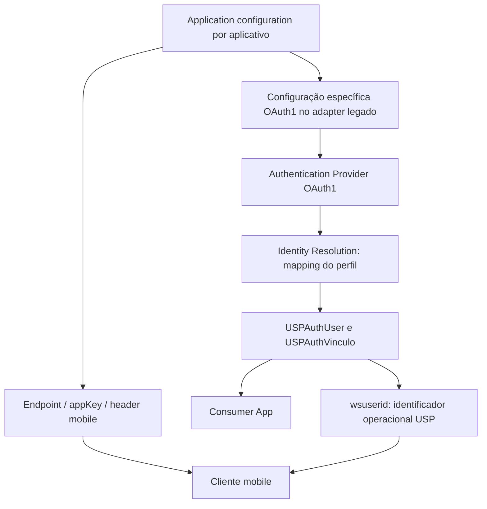
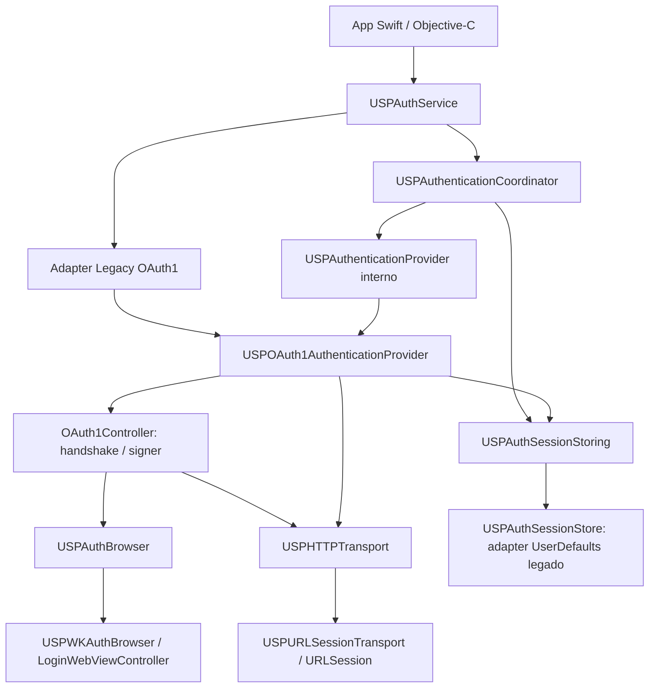
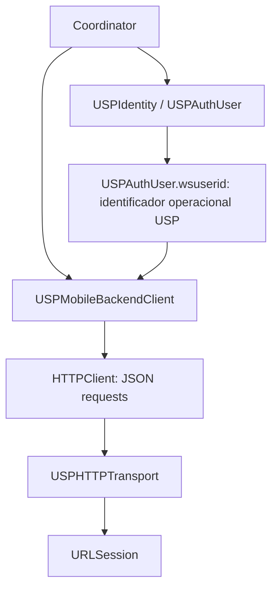
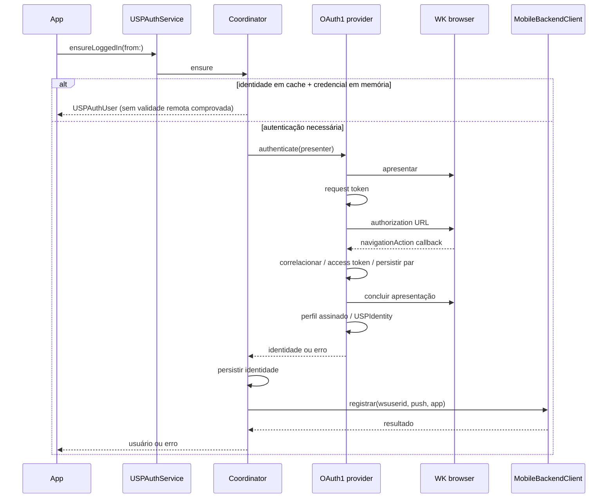
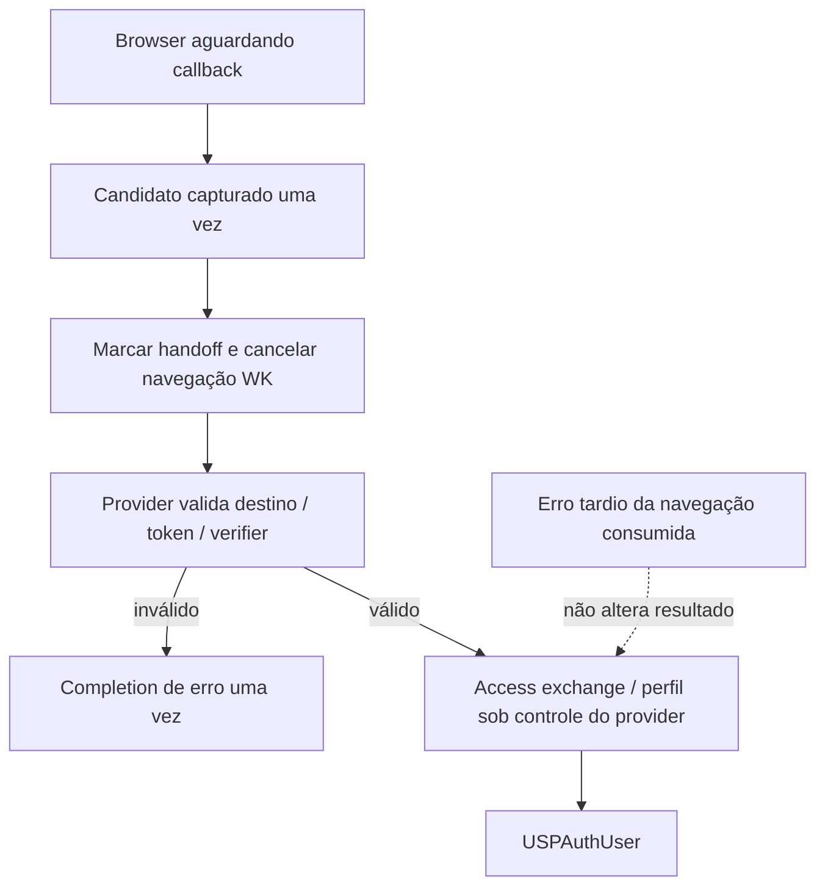
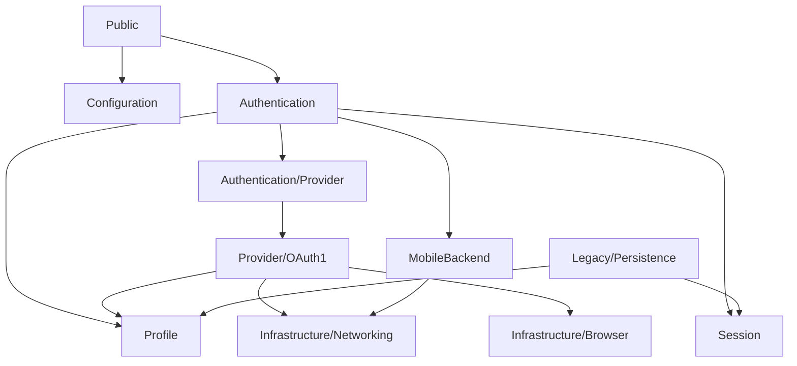

# Arquitetura implementada de autenticação

Modernização de 2026-10-01 sobre `a0e523e`; domínio revisado em 2026-10-02. O target continua Objective-C/C,
sem dependências novas, com mínimo declarado iOS14. OAuth2 não existe nesta
implementação. A [auditoria original](../modernization/current-architecture.md)
descreve o estado anterior; este documento descreve o código resultante.

[Nova integração](../integration/new-integration.md) · [Migração de legado](../integration/legacy-migration.md) · [README](../../README.md#uspauthkit)

## Responsabilidade do SDK e fonte de verdade

Este documento é a fonte de verdade da arquitetura implementada. USPAuthKit oferece
**autenticação USP, sessão local, perfil básico padronizado, vínculos institucionais,
wsuserid para recursos USP e integração mobile atual**. Não é definido pelo protocolo;
OAuth1 é seu mecanismo produtivo/default. Configuração, provider e perfil são
fronteiras distintas; outro mecanismo só será especificado quando houver contrato.

Cardápio homologou a composição local no iPhone: handshake/callback correlacionado,
perfil, registro e completion. PROD entregou vínculos esperados; DEV tinha array
vazio. Perfil/metadata/userData e restauração foram preservados. Evidência fornecida
pelo responsável, sem credenciais/PII registradas. Não extrapolar a todos os apps.

## Três fronteiras do domínio

1. **Application/Client Configuration:** cada aplicativo tem identificação e
   configuração próprias. `USPApplicationConfiguration` privado contém baseURL
   (ambiente já resolvido), appKey e backendHeaderValue. Não contém parâmetros de
   autenticação. Não foi criado um segundo enum de ambientes: os factories antigos
   continuam resolvendo ambiente em endpoint no adapter de compatibilidade.
2. **Authentication Provider:** recebe sua configuração específica na composição;
   possui credenciais/estado privados e autentica/resolve identidade. No provider1,
   consumerKey/consumerSecret são configuração OAuth1 **do aplicativo**; par
   oauthToken/oauthTokenSecret e handshake são estado privado produzido pelo fluxo.
3. **USP Identity/Profile:** resultado padronizado `USPAuthUser`/`USPAuthVinculo`,
   incluindo `wsuserid`. A fachada entrega esse modelo; consumidores não precisam
   interpretar JSON básico nem conhecer o protocolo que o resolveu.



Identity Resolution é responsabilidade efetiva do provider, não um framework ou
novo serviço: OAuth1 resolve a resposta de perfil usando o mapper existente.
`USPIdentity` aceita `initWithUser:`; outro mecanismo/test double pode fornecer o
modelo público diretamente, sem resposta JSON ou contrato OAuth. `initWithMetadata:`
permanece adapter do perfil HTTP legado e `metadata` serve persistência/userData.
Não há configuração ou campos de outro protocolo modelados nesta revisão.

`USPAuthConfig` público continua combinado por compatibilidade. `setConfig:` é
explicitamente adapter: passa configuração ao provider1 e projeta somente endpoint/
appKey para a configuração geral; consumer fields não entram no coordinator/mobile.
Factories públicos com consumerKey/consumerSecret são igualmente APIs legadas.
`applyApplicationConfiguration:` é entrada **privada** que configura instância sem
USPAuthConfig ou provider1. A precedência histórica config.appKey sobre service.appKey
para requests mobile foi mantida, assim como getters públicos independentes.

## Composição e responsabilidades





| Componente | Responsabilidade efetiva |
|---|---|
| USPAuthService | Fachada, composição default, configuração legada e adapters públicos; não faz handshake, assinatura ou parsing de perfil |
| USPAuthenticationCoordinator | Cache, identidade, registro após autenticar, push, operação em curso, logout local e cancelamento mobile |
| USPAuthenticationProvider | Contrato privado: identifier, reconhecer sessão/cached credential, autenticar para identidade, cancelar e limpar credencial em memória |
| USPOAuth1AuthenticationProvider | Par OAuth1, handshake, seleção do browser, persistência privada da credencial, request assinada de perfil e mapping da resposta |
| OAuth1Controller | Request token/authorize/access token, verifier, callback correlacionado, HMAC-SHA1 e encoding legado |
| USPWKAuthBrowser | Apresentação, navegação WK, callback escolhido pelo provider, cancelamento/fechamento; sem credenciais |
| LoginWebViewController | View/progresso/KVO e sinal de início/cancelamento injetados; não acessa singleton |
| USPMobileBackendClient | Registro, consulta, invalidação e metadados de push/app; recebe wsuserid do perfil, sem tokenSecret |
| HTTPClient / USPHTTPTransport | JSON request builder / envio arbitrário com bytes, resposta HTTP, NSError e cancel handle; sem regras OAuth ou usuário |
| USPAuthSessionStore | Adapter concreto do contrato de storage para schema histórico; única implementação produtiva continua UserDefaults |

`sharedService` / Swift `shared()` continuam composição default. Uma instância
cria seu store/provider/coordinator; a UI usa a operação que a iniciou.
`USPAuthServiceInternal.h` oferece composição **privada**, inclusive provider
alternativo em testes, sem DI obrigatória ou novo protocolo público. Configurar
pela class method continua configurando apenas o singleton, como antes.

A composição default mantém a URLSession compartilhada para OAuth/perfil e uma
session com delegate queue principal para mobile. Fakes substituem transporte e
browser internamente. Nenhum registry, service locator ou segundo target foi criado.

## Fluxo executado



O provider possui as requests autenticadas necessárias ao perfil. A resolução entrega o perfil USP básico, independentemente do mecanismo de
autenticação. Não foi introduzido um ProfileClient separado sem necessidade. `/mobile/.../oauth/...` permanece cliente mobile, não protocolo1.

## Modelos e persistência

- **Credencial de autenticação:** privada ao provider; OAuth1 mantém token +
  tokenSecret. Não há struct comum exigindo esses campos de outro provider.
- **USPIdentity:** metadata institucional e mapping `USPAuthUser`; retém payload
  legado para compatibilidade. `user` é mapeado em cada leitura da persistência legada, preservando R02.
  A inicialização tipada serializa os campos existentes somente para esse adapter.
- **wsuserid:** identificador operacional USP no contrato de `USPAuthUser`, utilizado
  pelos aplicativos para acessar recursos/serviços. Não é credencial do provider.
  O wrapper USPMobileCredential foi removido: apenas duplicava a string, sem estado
  próprio. Backend recebe `user.wsuserid` por register/check/invalidateUserIdentifier.
  O payload HTTP ainda chama esse campo `token` por compatibilidade de endpoint;
  esse nome wire não determina o significado no domínio.
  Apenas `currentWSUserId` mantém via metadata a distinção nullable legada
  (ausente/NSNull → nil; string vazia → vazia); o modelo tipado mantém sua normalização.
- **USPAuthSession:** providerIdentifier, providerState opaco, identidade e
  validade conhecida (`NO` hoje). Nenhuma expiração/refresh obrigatória inventada.
- **USPAuthSessionStoring:** load/save/update estado do provider/update identidade,
  clearSession/clearAll e metadata de push/registro. Domínio não usa NSUserDefaults.

`USPAuthSessionStore` traduz exclusivamente provider `oauth1` para as keys abaixo.
O nome anterior foi conservado; é a implementação conceitual
LegacyUserDefaultsSessionStore, sem necessidade de renomeação pública.

| Key legada | Representação atual |
|---|---|
| oauthToken / oauthTokenSecret | String; ausente quando nil/vazia ao persistir |
| userData | NSData JSON de dictionary; inclui wsuserid/PII |
| notificationToken | String opcional |
| notificationPlatform | String, default F |
| isRegistered | Bool local; não determina isLoggedIn |

Nenhuma key foi migrada, namespaced ou criptografada. R10 deve migrar credenciais
para Keychain com schema, falhas, upgrade e downgrade testados. O store concreto
**não** serializa outro provider hoje: futura implementação de envelope versionado
(R16) deverá satisfazer o mesmo contrato, sem reestruturar coordenador/transporte.
A escrita do par e perfil continua não transacional, como baseline.

## Perfil público canônico: classificação dos campos

| Modelo / campos | Conceito e contrato atual |
|---|---|
| USPAuthUser.loginUsuario | Identificação institucional de login; não senha/token de autenticação |
| nomeUsuario | Nome básico do usuário |
| emailPrincipalUsuario, emailAlternativoUsuario, emailUspUsuario | Contatos do perfil; podem ser vazios, são PII |
| numeroTelefoneFormatado | Contato formatado; string, não número nem requisito de autenticação |
| tipoUsuario | Classificação institucional conforme resposta; não enum de protocolos |
| wsuserid | Identificador operacional USP para consumo de recursos; integrante da identidade entregue |
| vinculos | Lista tipada USPAuthVinculo, representando relações institucionais |
| USPAuthVinculo.codigoSetor, codigoUnidade | Códigos institucionais NSInteger; ausência normaliza para0; NSNull numérico é achado legado ainda não corrigido |
| nomeUnidade, siglaUnidade | Descrição da unidade institucional |
| nomeVinculo, tipoVinculo | Descrição/classificação do vínculo; não scopes ou claims inventadas |

Models e headers públicos não foram alterados. Strings ausentes/NSNull/não-string
normalizam para vazia, lista de vínculos ausente/não-array vira vazia; itens não-
dictionary são ignorados. Isso descreve mapping existente, não valida completude
ou autorização remota. JSON singular `vinculo` pertence ao adapter; consumers usam
`user.vinculos`. Novos campos básicos devem ser discutidos e tipados, não incentivar
leitura de raw JSON. Perfil/wsuserid não devem ser registrados em logs de diagnóstico.

## Compatibility layer e semântica

Todos os cinco headers públicos, selectors, tipos/nullability e nomes Swift
permanecem intactos. `oauthToken`, `oauthTokenSecret`, `loginInWebView` e config
consumer key/secret estão sinalizados no implementation como Legacy OAuth1
Compatibility API. Não foram adicionados atributos de depreciação nesta entrega.

`loginInWebView` continua apenas a etapa tokens: não busca perfil nem registra.
No ponto privado de composição sem provider1, o adapter WK retorna erro explícito;
propriedades OAuth são nil. Outro provider não precisa imitá-las.

`currentUser` pode existir sem tokens; `isLoggedIn` mede estado local, não validade
remota; `ensure` pode retornar cache em memória que sobrevive à remoção externa dos
keys. Falha de registro ainda deixa identidade/par em cache e próxima chamada pode
retornar usuário sem registrar de novo. Essas divergências são testes legados,
**não** políticas futuras desejáveis. Status HTTP ignorado por token/perfil e
parser/payload permissivos continuam para R13. Mobile mantém política 2xx.

Logout limpa sessão/push/registro local. Não chama invalidar mobile, revogar OAuth
ou encerrar SSO/cookies. Invalidation mobile explícita não limpa store automaticamente.

## Hardening separado da extração

**S04 / R12:** SHA1Transform usa scratch local alinhado, não memória de entrada ou
workspace static; HMAC reduz chave longa em buffer próprio. Qualificadores const
privados refletem o contrato. Digest/assinatura permanecem iguais; quatro casos
curtos/longos reproduzidos antes, vetores e ASan/UBSan depois.

**S02/S03 / R11:** mudanças comportamentais intencionais:

- Callback usa `navigationAction.request.URL`, consome uma vez e exige token da
  tentativa + verifier não vazio; rejects query duplicada, destino/fragment indevidos.
- Aceita formas históricas `localhost?...`, `http[s]://localhost/?...`, sem porta,
  usuário/senha ou path adicional; fragment vazio ou `_=_`. O callback real
  `http://localhost/` com token correlacionado e verifier foi homologado no iPhone;
  variantes adicionais são cobertas automaticamente, não todas homologadas remotamente.
- Uma autenticação por instância; tentativa concorrente retorna erro1001.
- Logout/cancelamento cancelam requests, fecham browser e concluem uma vez;
  generations descartam callbacks tardios antes de persistir credenciais/identidade.
- Operações mobile em voo recebem cancelamento único no logout; registro tardio
  não reativa `isRegistered`. Operações concluídas saem do conjunto ativo.
- Browser entrega callback e transfere a responsabilidade ao provider antes de
  cancelar a navegação. Erros WK posteriores ao handoff não cancelam access exchange;
  erro anterior e cancel explícito permanecem ativos (regressão real102 corrigida).
- UI começa uma vez por operação e remove observer/delegates ao concluir.

Isso preserva o caminho OAuth1 válido, mas rejeita callbacks antes tolerados e
altera resultados de operações interrompidas. O caminho válido foi homologado no
Cardápio; cancel/logout/late results possuem cobertura determinística, sem alegar
homologação manual de todas as variantes de UI.
Não há promessa de thread safety geral para getters/setters legados; execução de
fluxos/cancelamento é serializada na fila principal. Sem timeout/retry novo.

## Independência e limites

Coordinator/provider contract, configuração geral e perfil tipado não exigem
consumerKey/consumerSecret, par OAuth, verifier, nonce, HMAC ou WKWebView. O teste
FakeAuthenticationProvider inicia sessão vazia, entrega o perfil completo e um
vínculo, passa pela fachada e registra wsuserid com duas configurações de app.
Não usa USPAuthConfig, provider1 ou browser. Outro teste prova round-trip do
modelo tipado no store legado sem estado OAuth.

Isso prova desacoplamento do **contrato interno de autenticação e identidade**.
O SDK inteiro não está livre de OAuth1: composição default/provider/signer/browser,
config e properties públicas legadas, e adapter UserDefaults ainda são específicos.
O coordinator não interpreta providerState. O store concreto continua traduzindo
somente estado OAuth1; esquema persistível de outro mecanismo não foi definido.
Nenhum mecanismo futuro foi projetado/implementado.

Backend conserva estado próprio de push/app e flag local isRegistered. Não há
estado independente de wsuserid que justifique USPMobileCredential. Validade
remota do identificador e política de registro não são deduzidas de seu nome;
permanecem limites observáveis do backend. Remover wrapper não muda endpoints.

Ver [validação](../modernization/validation.md#composição-interna-e-hardening--2026-10-01),
[guia de migração vigente](../integration/legacy-migration.md) e
[walkthrough](../iterations/06-auth-composition/walkthrough.md).

### Ownership após o callback OAuth1



Browser não decide validade OAuth: o provider mantém correlação estrita. O handoff
é marcado antes de policyCancel para proteger inclusive notificação reentrante.
Erros anteriores ao candidato são propagados; cancel explícito/logout permanecem
ativos enquanto exchange/perfil estão em voo. A correção não ignora102 globalmente.
Controles com browser real provam rejeição de callback inválido após o handoff.
Equivalência do fluxo válido foi homologada pelo responsável no Cardápio/iPhone.
O erro WK102 deixou de cancelar exchange válido. A cobertura permanente reproduz
o erro após handoff e garante sucesso/completion única, além dos controles negativos.


## Perfil legado preservado e homologação

OAuth1 usa initWithMetadata: com o NSDictionary original de /usuariousp.
O store escreve esse metadata como NSData JSON e remapeia o perfil ao restaurar.
Não há reconstrução pelo modelo neste caminho: chave singular/plural, arrays,
aliases e campos não modelados são preservados em userData. initWithUser: existe
para identidade fornecida diretamente pelo contrato tipado (fake), serializando
somente esse adapter legado. Modelos não prometem normalização de aliases novos.

DEV retornou vinculo vazio; PROD retornou vínculos esperados. Não foi alterado
parsing para corrigir diferença de dados. Testes protegem quantidade de vínculos,
metadata completo, userData e restauração com fixtures sintéticas. Instrumentação
manual temporária foi removida na consolidação; regressões comportamentais continuam.

## Garantias verificadas e pendências

Build/link/test iOS, R02, fake neutro, browser/provider/coordinator, Swift/ObjC,
checker5 e buffers C sanitizados protegem a extração. Cardápio é primeiro piloto
homologado no escopo acima; lista completa de consumidores continua pendente.
Não implementados: Keychain, políticas de refresh/expiration/revogação/SSO,
validação de todos status/payloads, hardening global de logs e outro provider.
Runtime14 não foi executado; toolchain disponível usa override15 na validação,
sem elevar mínimo14 declarado. Store produtivo suporta somente schema OAuth1;
outro mecanismo precisará adapter/envelope próprio, sem assumir formato de token.


## Organização do código

Árvore real após reorganização estrutural de 2026-10-02, sem mudança de API ou
comportamento. Os cinco headers permanecem em include por compatibilidade SPM/
umbrella/imports; Public contém as implementações dos quatro tipos públicos,
não headers internos. Não foi criado novo target produtivo ou provider.

```text
USPAuthKit/
├── Authentication/
│   ├── Composition/
│   │   └── USPAuthServiceInternal.h
│   ├── Provider/
│   │   ├── OAuth1/
│   │   │   ├── Crypto/
│   │   │   │   ├── Base64Transcoder.c
│   │   │   │   ├── Base64Transcoder.h
│   │   │   │   ├── hmac.c
│   │   │   │   ├── hmac.h
│   │   │   │   ├── sha1.c
│   │   │   │   └── sha1.h
│   │   │   ├── NSString+URLEncoding.h
│   │   │   ├── NSString+URLEncoding.m
│   │   │   ├── OAuth1Controller.h
│   │   │   ├── OAuth1Controller.m
│   │   │   ├── OAuthConfig.h
│   │   │   ├── USPOAuth1AuthenticationProvider.h
│   │   │   └── USPOAuth1AuthenticationProvider.m
│   │   └── USPAuthenticationProvider.h
│   ├── USPAuthenticationCoordinator.h
│   └── USPAuthenticationCoordinator.m
├── Configuration/
│   ├── USPApplicationConfiguration.h
│   └── USPApplicationConfiguration.m
├── Infrastructure/
│   ├── Browser/
│   │   ├── LoginWebViewController.h
│   │   ├── LoginWebViewController.m
│   │   ├── USPAuthBrowser.h
│   │   └── USPAuthBrowser.m
│   ├── Networking/
│   │   ├── HTTPClient.h
│   │   ├── HTTPClient.m
│   │   ├── USPAuthKitMutableURLRequest.h
│   │   ├── USPAuthKitMutableURLRequest.m
│   │   ├── USPHTTPTransport.h
│   │   └── USPHTTPTransport.m
│   └── Security/
│       ├── KeychainItemWrapper.h
│       └── KeychainItemWrapper.m
├── Legacy/
│   └── Persistence/
│       ├── USPAuthSessionStore.h
│       └── USPAuthSessionStore.m
├── MobileBackend/
│   ├── USPMobileBackendClient.h
│   └── USPMobileBackendClient.m
├── Profile/
│   ├── USPIdentity.h
│   └── USPIdentity.m
├── Public/
│   ├── USPAuthConfig.m
│   ├── USPAuthService.m
│   ├── USPAuthUser.m
│   └── USPAuthVinculo.m
├── Session/
│   ├── USPAuthSession.h
│   └── USPAuthSession.m
├── include/
│   ├── USPAuthConfig.h
│   ├── USPAuthKit.h
│   ├── USPAuthService.h
│   ├── USPAuthUser.h
│   └── USPAuthVinculo.h
├── .DS_Store
└── PrivacyInfo.xcprivacy
```

| Diretório | Responsabilidade |
|---|---|
| Public | Implementação da fachada e modelos/configuração públicos existentes |
| include | Única superfície exportada pelo módulo, cinco headers byte-idênticos |
| Configuration | Configuração interna neutra do aplicativo/endpoint/appKey/header |
| Authentication | Coordinator e composição privada da fachada, sem domínio OAuth no coordinator |
| Authentication/Provider | Contrato privado de autenticar e entregar identidade |
| Authentication/Provider/OAuth1 | Provider atual, controller handshake/signer/encoding e configuração histórica OAuth1 |
| Authentication/Provider/OAuth1/Crypto | Base64/HMAC/SHA1 utilizados pela assinatura atual |
| Profile | USPIdentity e adapter de metadata/perfil tipado, independente de OAuth |
| Session | Estado neutro de sessão e contrato USPAuthSessionStoring |
| Legacy/Persistence | USPAuthSessionStore concreto: tradução das keys/formato UserDefaults OAuth1 legado |
| MobileBackend | Registro/check/invalidate e metadados de app/push, usando user.wsuserid |
| Infrastructure/Networking | Transporte URLSession e builder HTTP JSON; helper histórico de requests preservado |
| Infrastructure/Browser | Abstração/lifecycle WK e apresentação, callback matcher injetado pelo provider |
| Infrastructure/Security | Wrapper Keychain histórico preservado; não significa migração para Keychain |



Profile/Session/MobileBackend/transport não importam implementação OAuth1. O adapter
Legacy é o único lugar que interpreta providerState OAuth1 no schema produtivo;
Session não interpreta token/secret. Public compõe provider default e mantém seus
adapters; isso é configuração/compatibilidade, não regra do coordinator.

### Testes espelhando as responsabilidades

```text
USPAuthKitTests/
├── Authentication/
│   ├── OAuth1/
│   │   ├── Crypto/
│   │   │   └── HMACInputTests.c
│   │   └── USPOAuth1ProviderTests.m
│   ├── USPAuthenticationCoordinatorTests.m
│   └── USPNeutralProviderTests.m
├── Compatibility/
│   ├── ObjectiveC/
│   │   ├── include/
│   │   │   └── USPAuthKitObjCFixture.h
│   │   └── USPAuthKitObjCFixture.m
│   ├── Swift/
│   │   └── SwiftSessionConsumerFixture.swift
│   └── USPAuthFacadeCompatibilityTests.m
├── Infrastructure/
│   ├── Browser/
│   │   └── USPAuthBrowserTests.m
│   └── Networking/
│       └── USPHTTPTransportTests.m
├── MobileBackend/
│   └── USPMobileBackendClientTests.m
├── Profile/
│   ├── USPAuthKitTests.swift
│   └── USPProfilePreservationTests.m
├── Public/
│   └── USPAuthServiceSessionTests.swift
├── Session/
│   └── USPAuthSessionStoreTests.m
└── Support/
    ├── USPAuthArchitectureTestCase.h
    └── USPAuthArchitectureTestCase.m
```

R02/fixture Swift movidos sem alterar conteúdo. Fixture ObjC continua target SPM
separado (nome inalterado) com path Compatibility/ObjectiveC. Testes internos são
categorias por responsabilidade da mesma classe USPAuthArchitectureTests, com
Support de doubles/helpers, compilados pelo harness iOS. SPM exclui somente áreas
ObjC desse target Swift, sem lista manual de sources produtivos. Quarenta selectors
arquiteturais e24baseline continuam executados. A suíte Swift anterior pequena
em Profile conserva também seus testes de config/parser, sem fragmentação artificial.

USPNeutralProviderTests.m não importa controller/signer/provider concreto, não
constrói OAuth1 nem fornece seus campos; o helper lazy de OAuth1 não é chamado.
O fake entrega perfil/vínculo/wsuserid e passa coordinator/fachada/mobile/cache;
asserts negativos de adapters públicos continuam verificando ausência de tokens.

### Acoplamento residual permitido

| Localização fora de Provider/OAuth1 | Classificação / justificativa |
|---|---|
| include/USPAuthService.h e USPAuthConfig.h | API pública/configuração OAuth1 legada inevitável; headers não alterados |
| Public/USPAuthConfig.m | Implementa configuração pública existente consumer key/secret por aplicativo |
| Public/USPAuthService.m | Composição default OAuth1/clock/nonce e adapters legacy token/config/login; domínio neutro não usa esses campos |
| Authentication/Composition/USPAuthServiceInternal.h | Composição privada: referência nullable ao provider1 para compatibility adapters; não exportada |
| Legacy/Persistence/USPAuthSessionStore.h/m | Tradução compatível de keys/par/providerIdentifier OAuth1; sem dependência concreta do provider |
| MobileBackend/USPMobileBackendClient.m | Apenas paths históricos /mobile/servicos/oauth/{registrar,consultar,invalidar}; contrato mobile, sem assinatura OAuth |
| Testes específicos e fixtures/Support | Caracterização OAuth1/compatibilidade e factory lazy; nenhum termo indica novo requisito produtivo |

Auditoria textual encontrou zero regras OAuth em coordinator, Profile, Session e
HTTPTransport. Referências reversas USPIdentity no provider são legítimas: contrato
de resultado e mapping do payload obtido, sem ownership dos modelos de perfil.
USPAuthUser/USPAuthVinculo e wsuserid pertencem a Public/Profile, não ao namespace
OAuth1. Não foram introduzidos acoplamentos indevidos para reorganizar diretórios.

Limites mantidos: facade default e configuração pública combinada ainda conhecem
provider1; store legado só traduz seu schema. Métodos compatibility baratos ficam
marcados na fachada, não foi criada categoria produtiva só para estética. OAuth1Controller
permanece o nome interno existente: já é handshake+signer, não se extraiu signer novo
nem renomeou classe usada pelos testes runtime. Wrapper HTTP/Keychain e OAuthConfig
históricos foram preservados, sem alegar callers ativos ou torná-los APIs recomendadas.

Mapa completo: [iteração11](../iterations/11-auth-layout/file-map.md). Cardápio
usa import USPAuthKit/API pública; não precisa conhecer nenhuma destas localizações.
