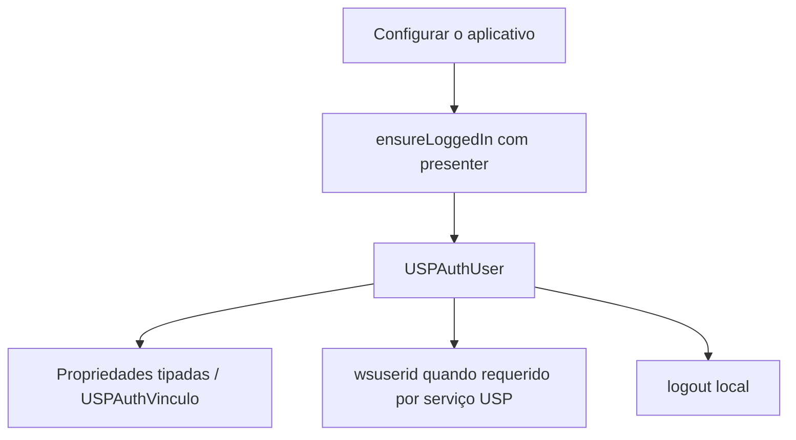

# Integração recomendada para novos aplicativos

Instale o product USPAuthKit do package USPMobileKit conforme o [README](../../README.md#uspauthkit).
iOS14 é o mínimo declarado, sem dependências SPM externas; API Swift/Objective-C.
A toolchain de desenvolvimento precisa suportar o deployment target adotado pelo app.

## Fluxo de integração

1. Obtenha configuração própria do app/ambiente com o responsável pelo serviço.
   Configure `USPAuthService.configure(with:consumerKey:consumerSecret:appKey:)`
   no bootstrap. Consumer key/secret são configuração específica OAuth1 atual,
   não identidade do usuário ou modelo universal. Não exponha secrets em logs.
2. Use `USPAuthService.shared().ensureLoggedIn(from:completion:)` na UI.
   Não apresente WKWebView própria nem implemente callback/assinatura. Trate erro
   e cancelamento; só prossiga com usuário presente e sem erro.
3. Use `USPAuthUser.nomeUsuario`, `loginUsuario`, contatos necessários e
   `user.vinculos` como `[USPAuthVinculo]`. Consulte [campos públicos](architecture.md#perfil-público-canônico-classificação-dos-campos).
   Strings podem estar vazias; vínculos podem ser vazios conforme resposta/ambiente.
4. Para serviços USP, use `user.wsuserid` quando exigido pelo endpoint; configure
   requests do app conforme o contrato daquele serviço. Não existe header universal
   de identidade definido pelo SDK. Não inferir TTL, refresh ou formato OAuth.
5. Nas consultas locais, use `currentUser()`; `isLoggedIn()` não revalida backend.
   O SDK restaura localmente o perfil. Não grave/limpe keys internas manualmente.
6. Encaminhe mudanças de token de push a `updateNotificationToken`. A operação
   registra quando há sessão; não é necessário copiar o registro no consumidor.
7. Use `logout()` para sessão local; limpe separadamente estado/cache próprio do app.
   Não esperar revogação OAuth, invalidação mobile automática ou logout SSO.

Exemplos Swift e Objective-C completos estão no README. Se usar instância própria,
configure a mesma instância via sua `config` pública; class methods de configuração
sempre operam no singleton. Não copie a composição privada usada pelos testes.

## Evitar em novo código

Não usar oauthToken/oauthTokenSecret, loginInWebView, keys de defaults, flag
isRegistered ou parsing manual de userData. Não depender de WKWebView, request/
access token, nonce, verifier ou assinatura OAuth. Essas APIs legadas permanecem
por compatibilidade, não são necessárias ao contrato de perfil.

Para vínculos, use `user.vinculos`; não `userData["vinculo"]`. Campos ausentes do
modelo que sejam necessários ao produto precisam de discussão e extensão pública
orientada pelo contrato real, em vez de acesso a detalhes internos.

## Garantias e limites

Fachada entrega autenticação + perfil USP padronizado; provider1 é implementação
atual. Fake independente de OAuth comprova o contrato interno com perfil/vínculo/
wsuserid completo. Cardápio homologou integração real no iPhone. Novas integrações
precisam validar login, perfil, recursos, restauração, cancelamento e logout.

Storage produtivo ainda é UserDefaults legado; Keychain pendente. Não há refresh,
expiração, revogação ou outro mecanismo modelado. Segurança e status/payload HTTP
possuem pendências documentadas no [roadmap](../modernization/modernization-roadmap.md).
