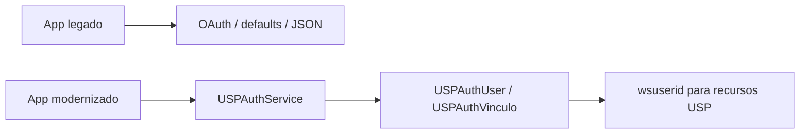
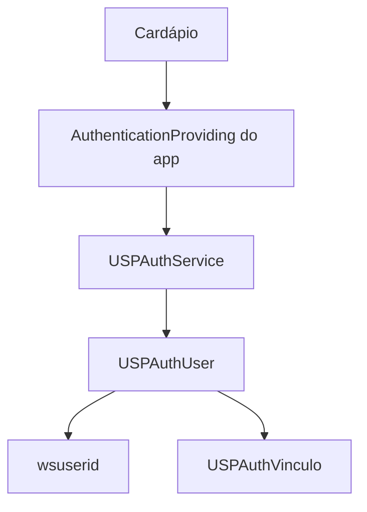

# Migração incremental de aplicativos legados

[README](../../README.md#uspauthkit) · [Nova integração](new-integration.md) ·
[Arquitetura interna](../authentication/architecture.md)

## Objetivo

Migrar dependências de OAuth1, storage e JSON bruto para a API pública de
autenticação e o perfil canônico `USPAuthUser`/`USPAuthVinculo`. Essa migração não
exige mudar o provider: OAuth1 continua implementado. Faça mudanças pequenas,
validáveis e reversíveis, preservando funcionalidades e dados necessários ao app.



Os headers e adapters públicos atuais conservam compatibilidade, mas dependências
acidentais não são contratos permanentes. Não remova um uso apenas porque é
legado: primeiro descubra sua finalidade e se existe substituição pública.

## 1. Auditoria inicial

Registre release/revisão aprovada, `Package.resolved`, targets Swift/Objective-C,
wrappers e comportamento antes de modificar o consumidor. Procure referências:

- `USPAuthService`, `USPAuthConfig`, `sharedService`/`shared()`, configuração e ambiente.
- `ensureLoggedIn`, `currentUser`, `currentWSUserId`, `isLoggedIn`, `logout`.
- `oauthToken`, `oauthTokenSecret`, consumer key/secret fora da configuração.
- `userData`, `isRegistered`, `UserDefaults`/`NSUserDefaults` e migrações/limpezas de keys.
- `wsuserid` e wrappers/snapshots que recebem esse valor; siga até requests e caches.
- `USPAuthUser`, `USPAuthVinculo`, parsing de perfil, vínculos e aliases.
- `loginInWebView` / Swift `login(in:completion:)`, `WKWebView`, callback/verifier.
- `notificationToken`, `notificationPlatform`, `updateNotificationToken`.
- `registerToken`, `invalidateToken`, `checkToken`, variantes com completion e registro próprio.
- Testes que semeiam tokens/JSON/defaults; runtime, KVC e imports de headers internos.

Buscas abaixo listam arquivos, evitando imprimir valores sensíveis. Execute na
raiz do consumidor e inspecione contexto localmente:

```bash
rg -l 'USPAuthService|USPAuthConfig|currentUser|currentWSUserId|ensureLoggedIn|wsuserid' --glob '*.{swift,m,h,mm}'
rg -l 'oauthToken|oauthTokenSecret|consumerKey|consumerSecret|loginInWebView|WKWebView|login\(in:' --glob '*.{swift,m,h,mm}'
rg -l 'userData|isRegistered|UserDefaults|NSUserDefaults|registerToken|invalidateToken|checkToken' --glob '*.{swift,m,h,mm}'
rg -l 'NSClassFromString|NSSelectorFromString|performSelector|valueForKey|setValue:|Core/' --glob '*.{swift,m,h,mm}'
```

Siga wrappers e callers; uma ausência textual não prova ausência de dependência
indireta. Separe código ativo, comentado, suporte de testes e targets não usados.
Não copie configuração sensível, perfil real ou identificadores para o relatório.

## 2. Classificação dos achados

| Classe | O que registrar |
|---|---|
| API pública recomendada | Login pela fachada, perfil tipado, logout local, push por update |
| API pública legada | Tokens OAuth, `userData`, login em WebView fornecida pelo app |
| Acesso direto ao storage | Keys, schema JSON/NSData, flag de registro, limpeza/semeadura |
| Conhecimento OAuth1 | Handshake, assinatura, request token/verifier; configuração normal sozinha não comprova esse acoplamento |
| Parsing de perfil | Campos usados, aliases, normalização, filtros e deduplicação de vínculos |
| Backend mobile | Registro, consulta, invalidação, push, endpoints próprios e uso de wsuserid |
| UI/browser | Quem apresenta, controla cancelamento e recebe completion |
| Testes | Fixtures privadas, mocks do app, dependências reais e cobertura de restauração/logout |

Um achado pode ter mais de uma classe. Diferencie uma propriedade pública de uma
key persistida com o mesmo nome; `isRegistered` não é propriedade pública do SDK.

## 3. Matriz de migração

| Dependência legada | Destino recomendado / limite atual |
|---|---|
| `UserDefaults["userData"]` | `currentUser()` e campos de `USPAuthUser`; remover conhecimento do schema de persistência |
| `userData["nomeUsuario"]`, login e contatos | Propriedades tipadas correspondentes, considerando strings vazias |
| Parsing manual de `wsuserid` | `USPAuthUser.wsuserid`; validar uso no endpoint, sem substituir por login/codpes |
| `currentWSUserId()` | Preferir `currentUser()?.wsuserid`; getter legado é nullable, modelo usa string vazia para ausente/nulo |
| JSON bruto de vínculos | `user.vinculos` e `USPAuthVinculo`, **se cobrirem o contrato utilizado**; comparar aliases, filtros e shape antes de migrar |
| `codpes`, número USP específico, foto ou campos não modelados | **Compatibilidade ainda necessária** quando indispensáveis e sem outra API do serviço; isolar o acesso e solicitar alternativa pública. Não há getter tipado equivalente no SDK |
| `UserDefaults["isRegistered"]` | Responsabilidade interna de registro; não trocar por `isLoggedIn`. Não existe getter público equivalente de estado remoto. Se a regra do app depender da flag, compatibilidade ainda necessária até redesenhar essa regra com evidência |
| `oauthToken` / `oauthTokenSecret` | Eliminar manipulação pelo consumidor; autenticar por `ensureLoggedIn`. Não há setter público neutro de sessão para substituir fixtures de credencial |
| `loginInWebView` / Swift `login(in:)` | `ensureLoggedIn` com presenter; login legado obtém tokens, não perfil + registro. Validar a mudança de escopo funcional |
| Controle direto de WKWebView/callback | Entregar apresentação ao fluxo público; UI completamente custom pode exigir adaptação de produto, sem API neutra de browser público inventada |
| `consumerKey`/`consumerSecret` | Manter somente na configuração específica do aplicativo/provider atual; remover usos em assinatura/handshake próprios |
| `config`, `appKey`, `backendHeaderValue` | Configuração pública atual preservada; separar endpoints próprios do app da base Auth. Não mudar valores nem precedência sem validar backend |
| Setting direto de `notificationToken` | `updateNotificationToken` quando se deseja persistir e atualizar registro; muda efeitos, portanto validar. Getter/platform continuam disponíveis quando necessários |
| Registro mobile próprio | Avaliar registro executado pelo SDK e, se necessário, `registerTokenWithCompletion:`. Não remover antes de comparar payload, timing, retries e resultado |
| `registerToken`, `checkToken`, `invalidateToken` | APIs complementares preservadas; preferir completion quando o app depende do resultado. Consulta não refresh; invalidação não logout |
| Limpeza manual de defaults para logout | `logout()` mais limpeza dos caches próprios do app; logout é local e cancela operações, sem revogação/SSO/cookies |
| Testes que escrevem keys/JSON do SDK | Preferir fake/adapter de autenticação do **app** e snapshots de perfil. Não importar provider/store privados; testes de integração com esquema legado devem ficar isolados/documentados enquanto necessários |

O mapper atual lê apenas array `vinculo`; plural/aliases podem permanecer no
`userData` preservado sem serem projetados para o modelo. Não trate diferença de
mapping como algo a corrigir silenciosamente no consumidor. Campos numéricos de
vínculo com `NSNull` também são limitação conhecida. Discuta contrato e eventual
extensão separadamente; esta orientação não introduz API ou normalização.

## 4. Estratégia incremental

1. **Inventariar:** registrar usos, release, contratos e baseline funcional/testes.
2. **Usar adapter no app quando útil:** aproveitar wrapper existente ou criar um
   pequeno adapter que reduza dependências; não exigir arquitetura única para todos.
3. **Centralizar a fachada:** configuração e chamadas ao mesmo serviço/instância,
   sem acesso distribuído ao singleton ou handshake paralelo.
4. **Migrar perfil:** nome/login/contatos pelo modelo, preservando tratamento de vazio.
5. **Migrar wsuserid:** encaminhar a propriedade tipada aos mesmos recursos;
   retirar fallbacks não comprovados só após validar seu contrato e necessidade.
6. **Migrar vínculos:** comparar shape, aliases e filtros usados; manter isolamento
   legado documentado se o modelo ainda não representar dados necessários.
7. **Remover storage direto:** inclusive suporte de testes/launch arguments, sem
   inventar setter público ou trocar `isRegistered` por um getter de sessão.
8. **Remover conhecimento OAuth1:** tokens, verifier, assinatura e WebView do app;
   configuração do provider atual permanece no bootstrap.
9. **Validar restauração:** encerrar/reabrir o app e verificar perfil e recursos.
10. **Validar logout:** sessão local, operações em curso e caches próprios.
11. **Validar recursos autenticados:** endpoints, registro e push conforme o app.

Atualizar o package e migrar o consumidor são mudanças distintas. Primeiro compile
na revisão aprovada sem adaptação e documente falhas. Depois migre um conjunto de
usos por vez com testes do app e smoke. Não force big bang nem mude provider nesse
processo. Veja os [nomes públicos e exemplos Swift/Objective-C](new-integration.md).

## 5. Cardápio USP como estudo de caso

O [inventário do Cardápio](../modernization/consumer-api-inventory.md#cardápio-usp)
registra código Swift/Objective-C e a homologação real posterior com o SDK local.
A versão 1.4.5 do inventário inicial é evidência histórica, não a versão que este
guia recomenda. Consulta estática atual confirmou os padrões legados abaixo;
o projeto não foi modificado por esta tarefa.

**Encontrado:** wrapper `AuthenticationProviding`, implementado pelo
`USPAuthenticationProvider` do **app**; uso de `USPAuthService.ensureLoggedIn` e
`currentUser`; snapshot com nome, login, wsuserid e `userData`. ProfileViewModel
parseia vínculos/aliases do dicionário; CreditService lê/escreve `isRegistered` e
faz registro próprio. Testes e AuthTestMode semeiam `userData`; alguns testes
manipulam as propriedades OAuth1. A configuração e callers incluem Objective-C;
a execução normal não controla a WKWebView de login.

**Estado desejado:** conservar o wrapper que já organiza o fluxo, consumindo o
perfil tipado e repassando o identificador aos serviços que o exigem:



Prioridades posteriores: abandonar raw `userData` para campos já tipados; migrar
vínculos após comparar aliases/filtros; retirar keys/flag de registro do app e dos
testes; avaliar registro próprio antes de removê-lo. Número USP/codpes e aliases
não cobertos requerem compatibilidade isolada ou contrato público adicional.
Preservar wsuserid nos destinos de saldo, Pix, boletos, foto, avisos, registro e
caches, sem equipará-lo a número USP ou token OAuth. Revisar logs/caches próprios
sem reproduzir identificadores reais.

Homologação confirmou login, perfil/wsuserid, registro/completion, recursos,
vínculos PROD e restauração. DEV retornava vínculos vazios: não houve perda de
payload pelo AuthKit. Isso não certifica todos consumidores ou todos fluxos de
push/cancelamento/versões do SO. O estudo de caso orienta migração, não autoriza
alterar o app nesta tarefa.

## 6. Validação pós-migração

Além de compilar/linkar todos os targets Swift/Objective-C afetados e executar
os testes do app, valide:

- App sem sessão e entrada que exige autenticação.
- Login real e continuidade da navegação após completion bem-sucedida.
- Cancelamento, falha e nova tentativa, sem continuação indevida.
- Perfil: nome, login, número USP quando aplicável ao contrato real do app.
- wsuserid utilizável nos recursos, sem logs de valores.
- Vínculos, incluindo perfil sem vínculos e diferenças DEV/PROD.
- Funcionalidades autenticadas: saldo/pagamentos/foto/avisos ou equivalentes.
- Registro mobile e push, quando aplicáveis.
- Restauração de perfil/vínculos após relaunch.
- Logout, limpeza dos caches próprios e login novamente.
- Cancelamento/logout com operação em curso, quando o app depende desse cenário.
- **Smoke físico** nas versões/dispositivos suportados pelo consumidor.

Separe evidências de **compilou**, **linkou** e **executou**. Testes host não provam
execução de `USPAuthService` iOS. Registre ambiente, revisão, resultados e limites;
não retenha logs com PII, tokens ou configuração sensível.

## 7. Rollback

Mantenha cada alteração pequena, revisável e reversível. Registre revisão/release
e configuração anteriores, respeite o lock e valide o retorno com sessão existente
ou reautenticação explícita quando necessário. O SDK não oferece feature flag
pública de seleção de provider nem conversão de credenciais. Não invente esses
mecanismos e não use edição manual de defaults para rollback. A migração do app
não deve depender de uma alteração simultânea de backend, storage e autenticação.

## 8. Critério de conclusão

Um consumidor está modernizado quando:

- Usa API pública para autenticação e configuração do aplicativo.
- Usa `USPAuthUser`/`USPAuthVinculo` como perfil canônico.
- Obtém wsuserid pela propriedade pública tipada.
- Não depende do storage interno nem da flag `isRegistered`.
- Não depende de JSON bruto sem necessidade documentada e isolada.
- Não conhece detalhes do handshake OAuth1 ou controla seu browser.
- Tem login, perfil, recursos, restauração e logout validados, incluindo smoke físico.

Se a migração depende de dados sem alternativa tipada, registre explicitamente a
compatibilidade restante e sua condição de retirada; não declare conclusão total.
A [classificação da superfície pública](new-integration.md#superfície-recomendada-e-compatibilidade)
é documental, sem deprecações novas ou remoção de métodos.
