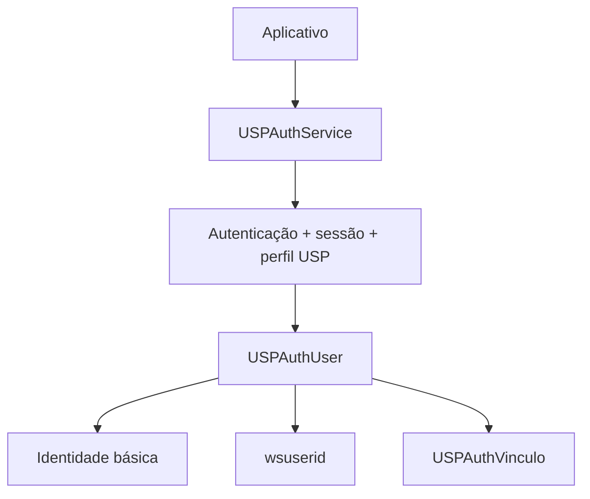

# Integração do USPAuthKit em novos aplicativos

[README](../../README.md#uspauthkit) · [Migração de legado](legacy-migration.md) ·
[Arquitetura interna](../authentication/architecture.md)

## 1. Visão geral

USPAuthKit fornece autenticação, sessão local e acesso padronizado à identidade e
ao perfil USP para aplicativos iOS. O consumidor utiliza `USPAuthService`,
`USPAuthUser` e `USPAuthVinculo`.



Internamente, a fachada delega autenticação a um provider, que resolve e entrega
`USPAuthUser`. OAuth1 é o provider atualmente implementado; seu handshake e sua UI
são detalhes internos. A arquitetura admite outros providers quando houver
contrato, sem definir aqui qualquer mecanismo futuro.

## 2. Requisitos e evidências

- iOS **14** é o mínimo declarado em `Package.swift`.
- Swift Package Manager e toolchain compatível com **Swift tools 6.1** do manifest.
- Swift ou Objective-C; importe o módulo `USPAuthKit`.
- UIKit: o login público recomendado recebe um `UIViewController` de apresentação.
- Não há dependências SPM externas; não é necessário instalar outro SDK de login.

O baseline documenta 64 testes Auth executados no Simulator iOS27, com deployment
15 apenas na invocação de validação, e homologação real do Cardápio no iPhone pelo
responsável. A versão do iOS físico não foi registrada nessa evidência. Runtime
**iOS14 ainda não tem validação registrada**: isso é lacuna de cobertura, não
incompatibilidade comprovada. Confirme as versões suportadas pelo seu app em
smoke próprio. Veja [resultados e limitações](../modernization/validation.md).

## 3. Adicionar o package

No Xcode, abra **File → Add Package Dependencies**, informe:

```text
https://github.com/STI-USP/USPMobileKit.git
```

O package é **USPMobileKit**; selecione o product **USPAuthKit** para o target do
app. Em um manifest consumidor, a dependência do target é
`.product(name: "USPAuthKit", package: "USPMobileKit")`. Importe `USPAuthKit`,
não `USPMobileKit`. O product `USPObservabilityKit` é independente e opcional.

Adote uma release publicada aprovada para seu app e versione `Package.resolved`
conforme a política do projeto. Revise notas e valide antes de atualizar; não use
uma branch móvel como política de distribuição. Este guia não atribui um número
à release arquitetural: as tags locais, sozinhas, não identificam sua publicação.
Para avaliação local no Xcode, **Add Local** aponta para o checkout USPMobileKit;
isso não substitui a referência de distribuição aprovada.

## 4. Configuração do aplicativo

Cada aplicativo precisa de configuração própria, obtida com o responsável pelo
serviço. Configure o singleton uma vez no bootstrap, antes de iniciar autenticação:

```swift
import USPAuthKit

func configurarAutenticacao() {
    USPAuthService.configure(
        with: .prod, // .dev para desenvolvimento
        consumerKey: "CONSUMER_KEY_DO_APP",
        consumerSecret: "CONSUMER_SECRET_DO_APP",
        appKey: "APP_KEY_DO_APP"
    )
}
```

| Entrada pública | Finalidade |
|---|---|
| `USPAuthEnvironment` (`.dev`, `.prod`, `.custom`) | Ambiente; factories dev/prod resolvem a base do SDK |
| `consumerKey`, `consumerSecret` | Configuração do provider OAuth1 atual, específica do aplicativo; não identidade do usuário |
| `appKey` | Identificação do aplicativo para o backend mobile |
| `USPAuthConfig.baseURL` | Base das chamadas do SDK; não configuração universal dos endpoints próprios do app |
| `backendHeaderValue` | Valor do header `DEV-USP-MOBILE` nas operações mobile; mantenha o default ou o valor acordado com o backend |

`consumerSecret` embarcado no app **não é um segredo seguro**. Não o exponha em
logs ou exemplos reais. A API atual combina configuração do app e do provider em
`USPAuthConfig`; não há uma nova configuração pública neutra para ensinar.
Usar esse bootstrap não exige manipular credenciais do usuário ou o protocolo.

Para base customizada, use o factory público e a sobrecarga existente; não passe
`.custom` ao método que recebe apenas o ambiente:

```swift
import USPAuthKit

func configurarAmbienteCustomizado() {
    let config = USPAuthConfig.custom(
        withBaseURL: "https://example.invalid",
        consumerKey: "CONSUMER_KEY_DO_APP",
        consumerSecret: "CONSUMER_SECRET_DO_APP",
        appKey: "APP_KEY_DO_APP"
    )
    USPAuthService.configure(with: config)
}
```

O endereço acima é sintético e não executa autenticação. Use a base aprovada no
seu ambiente. `configure` é um método de classe e configura **somente**
`shared()`/`sharedService`. Se já precisa de instância própria, `init` e a
propriedade pública `config` existem; configure e use essa mesma instância.
Não copie a composição interna dos testes nem introduza defaults próprios para
uma integração normal. Não troque configuração/ambiente durante um login.

## 5. Autenticação

Chame `ensureLoggedIn(from:completion:)` na UI, passando o controller visível que
pode apresentar a tela de autenticação. Ele retorna `USPAuthUser?` e `Error?`:
prossiga apenas com usuário presente e sem erro. O SDK controla a apresentação;
o app não precisa conhecer ou controlar uma WKWebView.

```swift
import UIKit
import USPAuthKit

func autenticar(from presenter: UIViewController,
                aoConcluir: @escaping @MainActor @Sendable (USPAuthUser) -> Void) {
    USPAuthService.shared().ensureLoggedIn(from: presenter) { user, error in
        DispatchQueue.main.async {
            guard error == nil, let user else {
                // Trate erro/cancelamento na UI. Não registre perfil ou credenciais.
                return
            }
            aoConcluir(user)
        }
    }
}
```

No caminho sem cache, a conclusão bem-sucedida inclui autenticação, obtenção do
perfil e registro mobile. Na implementação atual, erro de registro pode deixar
perfil/estado local persistido; não transforme `currentUser != nil` em sucesso de
uma operação que retornou erro. Evite iniciar outra tentativa enquanto a primeira
estiver ativa. Não há handle público de cancelamento: o usuário pode cancelar na
UI apresentada; `logout()` também interrompe operações em curso.

## 6. Perfil padronizado

Use o usuário retornado pela completion ou `currentUser()`, sem ler JSON bruto.
Todas as propriedades abaixo são públicas e somente leitura:

| Campo de `USPAuthUser` | Uso |
|---|---|
| `nomeUsuario` | Nome para apresentação |
| `loginUsuario` | Login institucional; não é automaticamente número USP |
| `emailPrincipalUsuario`, `emailAlternativoUsuario`, `emailUspUsuario` | Contatos, quando fornecidos |
| `numeroTelefoneFormatado` | Contato em string |
| `tipoUsuario` | Classificação institucional retornada no perfil |
| `wsuserid` | Identificador operacional USP para recursos que adotam esse contrato |
| `vinculos` | Lista `[USPAuthVinculo]` |

Strings ausentes, nulas ou de tipo diferente de string são normalizadas para
`""` pelo modelo atual. Não assuma que todos os campos estejam preenchidos. Não há
propriedade pública de foto ou de número USP específico; não derive esses dados
de `wsuserid`. Recursos adicionais seguem o contrato dos respectivos serviços.

**wsuserid** é o identificador operacional USP retornado no perfil e utilizado
pelos aplicativos para consumir recursos dos serviços mobile que adotam esse
contrato. Não é OAuth token nem access token. O SDK não define um header universal
para requests próprias do app nem comprova expiração/validade remota por sua
presença. Use `user.wsuserid` somente conforme o contrato do endpoint e não o
registre, assim como nomes, contatos e demais dados pessoais.

## 7. Vínculos institucionais

Consuma `user.vinculos`, sem interpretar `vinculo`/`vinculos` do JSON:

```swift
import USPAuthKit

func descricoesDosVinculos(de user: USPAuthUser) -> [String] {
    user.vinculos.map { vinculo in
        "\(vinculo.nomeVinculo) — \(vinculo.nomeUnidade) (\(vinculo.siglaUnidade))"
    }
}
```

| Campo de `USPAuthVinculo` | Tipo importado em Swift / significado |
|---|---|
| `codigoSetor`, `codigoUnidade` | `Int` / códigos institucionais |
| `nomeUnidade`, `siglaUnidade` | `String` / descrição e sigla da unidade |
| `nomeVinculo`, `tipoVinculo` | `String` / descrição e classificação do vínculo |

O mapper atual lê o array singular `vinculo`; itens que não são dicionários são
ignorados. Não interpreta todos os aliases possíveis. Lista ausente/não-array
vira vazia, e DEV pode retornar lista vazia mesmo quando PROD fornece vínculos.
Uma lista vazia não comprova falha de autenticação. Códigos ausentes viram zero;
`NSNull` nesses campos numéricos é limitação legada ainda não corrigida. Se o
modelo não cobre um campo necessário, solicite extensão baseada no contrato real;
não invente propriedades ou parsing de perfil para uma integração nova.

## 8. Sessão existente

O SDK carrega o estado local na inicialização e permite consultar o perfil sem
manipular armazenamento. Não há `restoreSession` público separado:

```swift
import USPAuthKit

func perfilLocal() -> USPAuthUser? {
    USPAuthService.shared().currentUser()
}

func existeSessaoLocal() -> Bool {
    USPAuthService.shared().isLoggedIn()
}
```

`currentUser()` pode existir **independentemente de uma sessão OAuth completa**.
`isLoggedIn()` verifica estado local de perfil e credencial reconhecida pelo
provider atual; não valida sessão no servidor. `ensureLoggedIn` reutiliza cache
quando disponível ou inicia o fluxo necessário. Nenhum desses getters prova
autorização nos recursos remotos; trate os erros dos serviços consumidos pelo app.
`currentWSUserId()` continua público, mas prefira `currentUser()?.wsuserid`.

## 9. Logout

```swift
import USPAuthKit

func encerrarSessaoLocal() {
    USPAuthService.shared().logout()
}
```

`logout()` limpa estado local de autenticação, perfil, push e registro, restaura a
plataforma de notificação legada `F` e cancela operações em curso. Não chama
`invalidateToken` automaticamente. Não promete revogação remota, encerramento SSO
ou limpeza de cookies. O app limpa separadamente suas telas e caches pessoais;
se ainda mantém token de push próprio, reaplique-o quando apropriado ao seu fluxo.

O comentário legado do header que menciona invalidação no servidor não descreve
a implementação atual de `logout`; a operação é local, conforme testes R02 e
[arquitetura vigente](../authentication/architecture.md#compatibility-layer-e-semântica).

## 10. Push e backend mobile

Autenticação resolve a identidade; registro mobile associa `wsuserid`, app e
metadados de push. O SDK registra no caminho de login sem cache. Encaminhe mudanças
do token obtido pela integração de push do app a `updateNotificationToken(_:)`:
ele persiste o valor e solicita registro quando há sessão local e o valor mudou.
O SDK não obtém o token do APNs/FCM por conta própria.

Setting direto de `notificationToken` não tem o mesmo efeito de registro.
`notificationPlatform` conserva o default histórico `F`; outro valor depende do
contrato do backend e da integração do app, sem enum público de plataformas.
Não leia/escreva `isRegistered` nem use `isLoggedIn` como substituto para essa flag.

As APIs complementares `registerToken`, `checkToken` e `invalidateToken` permanecem
públicas. Não são passos obrigatórios de uma integração nova; use apenas quando
houver necessidade de backend documentada, preferindo variantes com completion.
Consulta não renova autenticação; invalidação mobile não limpa a sessão local nem
encerra SSO. Não deduza schema de consulta além do dicionário retornado: não há
modelo público tipado de estado mobile. Não duplique registro no app sem avaliar
a operação que o SDK já executa.

## 11. Erros e cancelamento

Não há enum público de erros de autenticação. A completion Swift importa
`NSError` como `Error`; Objective-C recebe `NSError *`. Falhas podem vir de
configuração, browser, transporte, parsing, perfil ou registro mobile. Não prometa
uma taxonomia estável inexistente nem registre `userInfo`, URLs ou descrições
integrais sem sanitização.

Cancelamento explícito do login atualmente usa domínio `LoginWebViewController`
e código Foundation `NSUserCancelledError`. Esse reconhecimento descreve a
implementação presente, não um novo tipo público:

```swift
import Foundation

func foiCancelamentoDoLogin(_ error: Error) -> Bool {
    let erro = error as NSError
    return erro.domain == "LoginWebViewController" && erro.code == NSUserCancelledError
}
```

Uma tentativa concorrente falha; serialize os pedidos de login do app. Trate
cancelamento como escolha do usuário e permita nova tentativa. Outros erros devem
interromper a ação dependente de autenticação. Os métodos de fluxo entregam
completion na fila principal na implementação atual; isso não estabelece thread
safety geral para todos os getters/setters legados.

## 12. Exemplo completo Swift e equivalente Objective-C

Chame a configuração da seção 4 no bootstrap. O controller abaixo fornece uma
entrada de login, consome perfil/vínculos e permite logout. Os métodos podem ser
conectados aos botões da sua UI. A callback `aoAutenticar` pertence ao **exemplo do
app**, não à API do package. O dispatch explícito para a fila principal permite
atualizar UIKit sem depender de annotations de concorrência ausentes no header
Objective-C legado; não altera a API baseada em completion:

```swift
import UIKit
import USPAuthKit

final class PerfilViewController: UIViewController {
    private let resumo = UILabel()
    var aoAutenticar: ((USPAuthUser) -> Void)?

    override func viewDidLoad() {
        super.viewDidLoad()
        resumo.numberOfLines = 0
        resumo.frame = CGRect(x: 20, y: 100, width: 300, height: 200)
        view.addSubview(resumo)
        if let user = USPAuthService.shared().currentUser() {
            apresentar(user)
        }
    }

    func entrar() {
        USPAuthService.shared().ensureLoggedIn(from: self) { [weak self] user, error in
            DispatchQueue.main.async {
                guard let self else { return }
                if let error {
                    let erro = error as NSError
                    let cancelado = erro.domain == "LoginWebViewController"
                        && erro.code == NSUserCancelledError
                    self.resumo.text = cancelado ? "Login cancelado." : "Não foi possível entrar."
                    return
                }
                guard let user else {
                    self.resumo.text = "Perfil indisponível."
                    return
                }
                self.apresentar(user)
                // Encaminhe user.wsuserid conforme o contrato do recurso do app.
                self.aoAutenticar?(user)
            }
        }
    }

    private func apresentar(_ user: USPAuthUser) {
        let vinculos = user.vinculos.map { "\($0.nomeVinculo) — \($0.nomeUnidade)" }
        resumo.text = ([user.nomeUsuario, user.loginUsuario] + vinculos).joined(separator: "\n")
    }

    func sair() {
        USPAuthService.shared().logout()
        resumo.text = "Sem sessão local."
        // Limpe também os caches de perfil/recursos mantidos pelo próprio app.
    }
}
```

Em Objective-C, os selectors são os dos headers públicos. Este exemplo é uma
função do aplicativo que configura e inicia o fluxo, sem autenticação real durante
o compile-check:

```objc
@import UIKit;
@import USPAuthKit;

void AutenticarUsuarioUSP(UIViewController *presenter,
                         void (^aoConcluir)(USPAuthUser *)) {
    [USPAuthService configureWithEnvironment:USPAuthEnvironmentProd
                                consumerKey:@"CONSUMER_KEY_DO_APP"
                             consumerSecret:@"CONSUMER_SECRET_DO_APP"
                                     appKey:@"APP_KEY_DO_APP"];
    [[USPAuthService sharedService] ensureLoggedInFromViewController:presenter
        completion:^(USPAuthUser *user, NSError *error) {
            if (error || !user) return; // Trate falha/cancelamento na sua UI.
            NSString *nome = user.nomeUsuario;
            NSString *login = user.loginUsuario;
            NSString *identificador = user.wsuserid;
            NSArray<USPAuthVinculo *> *vinculos = user.vinculos;
            (void)nome; (void)login; (void)identificador; (void)vinculos;
            aoConcluir(user);
        }];
}

void EncerrarSessaoUSP(void) {
    [[USPAuthService sharedService] logout];
}
```

## 13. O que NÃO fazer

Para novas integrações:

- Não acessar UserDefaults do AuthKit nem ler/escrever `isRegistered`.
- Não ler/escrever `userData` nem depender do JSON bruto do perfil.
- Não manipular `oauthToken` ou `oauthTokenSecret`.
- Não depender de request token, verifier, assinatura ou lógica do handshake OAuth1.
- Não controlar diretamente a WebView de autenticação.
- Não assumir que `wsuserid` seja OAuth access token, número USP ou possua validade comprovada.
- Não registrar perfil, vínculos, configuração sensível ou identificadores em logs.

`userData`, propriedades OAuth1 e `loginInWebView` são **APIs mantidas para
compatibilidade com consumidores existentes; não recomendadas para novas
integrações**. `userData` é readonly: não existe setter público para perfil.
Keys internas e `isRegistered` nem sequer são APIs públicas. As factories atuais
de configuração continuam necessárias para usar o provider disponível.

## Superfície recomendada e compatibilidade

| Grupo | Superfície existente / orientação |
|---|---|
| Recomendada | `sharedService`/`shared()`, `ensureLoggedIn`, `currentUser`, `USPAuthUser`, `USPAuthVinculo`, `USPAuthUser.wsuserid`, `logout`, `isLoggedIn` com limite local, `updateNotificationToken` quando houver push |
| Configuração necessária atual | `configureWithEnvironment…` / `configure(with:consumerKey:consumerSecret:appKey:)`, `configureWithConfig:` / `configure(with:)`, `USPAuthConfig` e seus factories dev/prod/custom; `config`, `appKey`, `backendHeaderValue` quando necessários |
| Complementar, dependente do backend | `notificationPlatform`; `registerToken`, `checkToken`, `invalidateToken` e variantes com completion. Não são APIs de perfil nem requisitos universais de login |
| Compatibilidade; evitar novo código | `userData`, `oauthToken`, `oauthTokenSecret`, `loginInWebView` / Swift `login(in:completion:)`, `currentWSUserId` como alternativa legada ao modelo; setter direto de `notificationToken` não substitui update |
| Construção pública especializada | `init`, `initWithUserDefaults:` / `init(userDefaults:)` e initializers de dicionário dos modelos existem, mas não são necessários ao fluxo recomendado; não devem servir para semear uma sessão manualmente |
| Interno; não API | Keys de persistência, `isRegistered`, provider/coordinator/transporte/browser/store e headers privados |

Essa classificação é documental: nenhuma annotation de depreciação ou mudança de
API foi adicionada. Se já usa caminhos legados, siga o [playbook de migração](legacy-migration.md).
