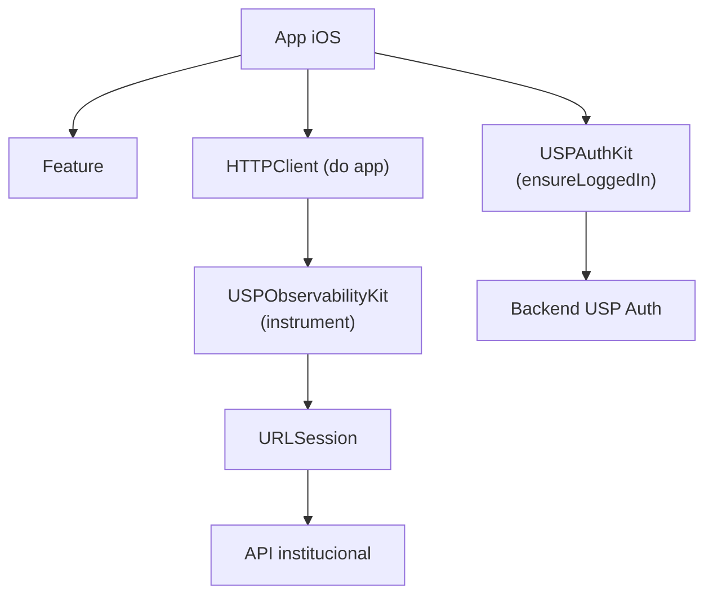

# Evolução do USPAuthKit → USPMobileKit

## Diagnóstico do package atual

### Inventário

| Item | Estado atual |
|---|---|
| `Package.swift` | `swift-tools-version: 6.1`, plataforma `iOS(.v12)` |
| Products | 1 → `USPAuthKit` (library) |
| Targets | 2 → `USPAuthKit` (ObjC/C misto) + `USPAuthKitTests` (Swift) |
| Dependências externas | **Nenhuma** — zero dependências SPM externas |
| Linguagem | Objective-C + C (HMAC/SHA1/Base64) no source; Swift apenas nos testes |
| Armazenamento de sessão | `NSUserDefaults` (via `USPAuthSessionStore`) |
| Armazenamento de tokens OAuth | `NSUserDefaults` — `oauthToken`, `oauthTokenSecret` |
| Swift Concurrency | **Não utilizado** — callback-based (dispatch_async) |
| Firebase | **Ausente** — nenhuma dependência |
| Networking | `NSURLSession` encapsulado em `HTTPClient` interno (privado) |
| UI | `LoginWebViewController` (WKWebView) — target requer UIKit |
| Tests | 5 testes Swift (parser OAuth, mapeamento user, config factory) |
| iOS mínimo | iOS 12 |
| Versões tagueadas | 1.0.0 … 1.4.5 |
| Branch feature | `feature/USPMobileKit` já existe no remoto |

### API pública atual (itens que não podem quebrar)

```
USPAuthService          (ObjC class)
  +sharedService
  +configureWithEnvironment:consumerKey:consumerSecret:appKey:
  +configureWithConfig:
  -initWithUserDefaults:
  -ensureLoggedInFromViewController:completion:
  -loginInWebView:completion:
  -isLoggedIn
  -currentUser → USPAuthUser?
  -currentWSUserId → NSString?
  -updateNotificationToken:
  -registerToken / -registerTokenWithCompletion:
  -invalidateToken / -invalidateTokenWithCompletion:
  -checkToken / -checkTokenWithCompletion:
  -logout
  oauthToken, oauthTokenSecret (properties)
  appKey, backendHeaderValue (properties)
  notificationToken, notificationPlatform (properties)

USPAuthUser             (ObjC class)
  loginUsuario, nomeUsuario, emailPrincipalUsuario
  emailAlternativoUsuario, emailUspUsuario
  numeroTelefoneFormatado, tipoUsuario, wsuserid
  vinculos: [USPAuthVinculo]
  -initWithDictionary:

USPAuthVinculo          (ObjC class)
  codigoSetor, codigoUnidade, nomeUnidade
  nomeVinculo, siglaUnidade, tipoVinculo
  -initWithDictionary:

USPAuthConfig           (ObjC class)
  environment, baseURL, consumerKey, consumerSecret, appKey
  +devWith…  +prodWith…  +customWithBaseURL:…

USPAuthEnvironment      (NS_ENUM)
  .dev / .prod / .custom
```

### Abstrações potencialmente compartilháveis entre módulos

Após análise cuidadosa: **nenhuma** abstração interna do `USPAuthKit` (HTTPClient, SessionStore, OAuth1Controller, Base64/HMAC/SHA1) faz sentido em um Core compartilhado com observabilidade. São primitivos exclusivamente de Auth.

**Decisão sobre USPMobileCore**: não criar o target agora. Documentamos a decisão arquitetural e reservamos o nome no `Package.swift` como comentário. O Core só deve existir quando dois ou mais módulos precisarem genuinamente de uma abstração comum.

---

## User Review Required

> [!IMPORTANT]
> **Nome do package SPM**: O `Package.swift` atual tem `name: "USPAuthKit"`. Mudar para `"USPMobileKit"` não quebra os consumidores que dependem via URL de repositório (o que importa é o URL + product name, não o package name). A mudança é **não-breaking** para Xcode. Confirmar se é desejado já neste PR.

> [!IMPORTANT]
> **iOS mínimo**: A iteração adota `iOS(.v14)` para todo o package. Trata-se de uma alteração de compatibilidade para consumidores que ainda suportam iOS 12 ou 13, aprovada para esta evolução. Os módulos permanecem compatíveis com apps cujo deployment target seja iOS 14 ou superior.

> [!WARNING]
> **Installation ID e backup/restore**: por padrão, `UserDefaults` é incluído no backup do iCloud. Se o usuário restaurar um backup em outro dispositivo, o Installation ID será copiado junto. Isso **não** transforma o ID em identificador de hardware, mas dois dispositivos podem temporariamente ter o mesmo ID. Documentamos o comportamento e recomendamos excluir a key do backup com `FileProtection`. Apresentar a decisão antes de implementar: usar `UserDefaults` (simples, backup incluído) ou `FileManager` com `isExcludedFromBackup = true` (mais correto). **Recomendação: usar `UserDefaults` com documentação clara do comportamento.**

> [!NOTE]
> **OpenTelemetry como dependência**: A biblioteca oficial Swift OpenTelemetry (`opentelemetry-swift`) tem tamanho considerável e traz dependências transitivas. Estratégia recomendada: criar `USPObservabilityKit` sem depender de OTel, e um target/product adicional `USPObservabilityOpenTelemetry` com a dependência real. Apps que não usam distributed tracing não pagam o custo. **Aprovação necessária antes de adicionar dependências externas**.

> [!NOTE]
> **Firebase**: não incluído nesta iteração. Reservar o nome `USPObservabilityFirebase` no plano mas não implementar ainda, conforme pedido de limites arquiteturais.

---

## Open Questions

1. O repositório deve ser renomeado fisicamente para `USPMobileKit` (impacta URL do SPM nos apps consumidores) ou mantemos `USPAuthKit` como nome do repositório e mudamos apenas o `Package.swift`?
2. A branch `feature/USPMobileKit` já existe — devo trabalhar diretamente nela ou em uma nova branch?
3. O `USPObservabilityOpenTelemetry` target deve ser incluído nesta iteração ou somente o `USPObservabilityKit` base?

---

## Proposed Changes

### Estratégia geral

1. **Zero breaking changes** no `USPAuthKit` — os arquivos `.h`/`.m` não mudam de conteúdo nem de localização.
2. O `Package.swift` é o único arquivo que muda no lado Auth.
3. Novos targets são **adicionados**, não modificados.
4. O nome do package SPM muda de `"USPAuthKit"` para `"USPMobileKit"` (não-breaking).

---

### Package.swift

#### [MODIFY] [Package.swift](file:///Users/vagner/Projects/STI%20Mobile/USPAuthKit/Package.swift)

- Renomeia `name:` de `"USPAuthKit"` para `"USPMobileKit"`
- Mantém product `USPAuthKit` idêntico (zero impacto nos consumidores)
- Adiciona product `USPObservabilityKit`
- Adiciona targets `USPObservabilityKit` e `USPObservabilityKitTests`
- Adiciona dependência opcional de `opentelemetry-swift` apenas para o target `USPObservabilityOpenTelemetry`
- Mantém `iOS(.v12)` para `USPAuthKit`; `USPObservabilityKit` exige `iOS(.v14)` (Swift Concurrency backport via async/await — se necessário reduzir para 12, usa callback)

---

### USPObservabilityKit — novos arquivos

```
Sources/USPObservabilityKit/
├── HTTPRequestInstrumenting.swift          # protocolo público principal
├── CompositeInstrumenter.swift             # composição de múltiplos instrumentadores
├── USPContextInstrumenter.swift            # adiciona todos USP-* headers
├── Providers/
│   ├── AppInfoProvider.swift               # protocolo + implementação real
│   ├── OSVersionProvider.swift             # protocolo + implementação real
│   ├── DeviceModelProvider.swift           # protocolo + impl (sysctl)
│   └── InstallationIDProvider.swift        # protocolo + impl (UserDefaults + UUID)
├── W3C/
│   ├── TraceContext.swift                  # struct traceparent / tracestate
│   └── TraceContextInstrumenter.swift      # instrumentador W3C (sem OTel)
└── Internal/
    └── KeychainStorage.swift               # (opcional: migration path)
```

#### [NEW] `HTTPRequestInstrumenting.swift`

```swift
public protocol HTTPRequestInstrumenting: Sendable {
    func instrument(_ request: URLRequest) throws -> URLRequest
}
```

#### [NEW] `CompositeInstrumenter.swift`

Aplica múltiplos `HTTPRequestInstrumenting` em sequência. Permite composição no app sem acoplar módulos entre si.

#### [NEW] `USPContextInstrumenter.swift`

Adiciona os 6 headers `USP-*`. Recebe providers injetados por construtor (testáveis).

#### [NEW] `Providers/AppInfoProvider.swift`

```swift
public protocol AppInfoProviding: Sendable {
    var platform: String { get }      // sempre "ios"
    var version: String { get }       // CFBundleShortVersionString
    var build: String { get }         // CFBundleVersion
}
```

#### [NEW] `Providers/DeviceModelProvider.swift`

```swift
public protocol DeviceModelProviding: Sendable {
    var deviceModel: String { get }   // e.g. "iPhone14,2"
}
```
Usa `uname()` / `sysctlbyname("hw.machine")` — sem IDFA/IDFV.

#### [NEW] `Providers/OSVersionProvider.swift`

```swift
public protocol OSVersionProviding: Sendable {
    var osVersion: String { get }     // e.g. "17.5"
}
```

#### [NEW] `Providers/InstallationIDProvider.swift`

```swift
public protocol InstallationIDProviding: Sendable {
    var installationID: String { get }  // UUID string
}
```

`DefaultInstallationIDProvider`: persiste UUID em `UserDefaults` com key `com.usp.mobile.installationID`. Gera novo UUID se ausente. Comportamento em restore/reinstall documentado.

#### [NEW] `W3C/TraceContext.swift`

```swift
public struct TraceContext: Sendable {
    public let traceID: String    // 32 hex chars
    public let spanID: String     // 16 hex chars
    public let flags: UInt8
    public var traceparent: String { "00-\(traceID)-\(spanID)-\(String(format: "%02x", flags))" }
}
```

Gera `traceID` e `spanID` usando `UUID` → hex (compatível W3C, sem OTel obrigatório).

#### [NEW] `W3C/TraceContextInstrumenter.swift`

Implementa `HTTPRequestInstrumenting`. Injeta `traceparent` (e `tracestate` opcional) por request. Compatível com OpenTelemetry quando o app optar pelo target `USPObservabilityOpenTelemetry`.

---

### Tests/USPObservabilityKitTests/

Novos testes Swift cobrindo:

- `testPlatformIsAlwaysIOS`
- `testAppVersionFromProvider`
- `testBuildFromProvider`
- `testOSVersionFromProvider`
- `testDeviceModelNonEmpty`
- `testInstallationIDGeneration`
- `testInstallationIDPersistence`
- `testInstallationIDReuse`
- `testInstallationIDNotPersonalData`
- `testUSPHeadersPresent`
- `testAuthorizationHeaderPreserved`
- `testCompositeInstrumenterOrdering`
- `testConcurrentInstrumentationIsDataRaceFree`
- `testTraceparentFormat`
- `testTraceContextInstrumenterAddsHeader`

---

### README.md

#### [MODIFY] [README.md](file:///Users/vagner/Projects/STI%20Mobile/USPAuthKit/README.md)

Reestruturado como documento principal do **USPMobileKit**, com seções:
- Visão geral
- Módulos disponíveis
- USPAuthKit — instalação + uso
- USPObservabilityKit — instalação + uso + contrato de headers
- Exemplos de integração (Auth only / Observability only / ambos)
- Independência arquitetural entre módulos
- Decisão sobre USPMobileCore (não criado ainda + justificativa)

---

## Arquitetura resultante

```
Package "USPMobileKit"
│
├── Product: USPAuthKit  ──────────────────────▶  Target: USPAuthKit (ObjC/C)
│                                                   ↳ sem dependências externas
│
├── Product: USPObservabilityKit  ────────────▶  Target: USPObservabilityKit (Swift)
│                                                   ↳ sem dependências externas
│
└── (futuro) Product: USPObservabilityOpenTelemetry
                                             ▶  Target: USPObservabilityOpenTelemetry (Swift)
                                                   ↳ dep: opentelemetry-swift
                                             (não implementado nesta iteração)
```

**Sem dependência entre Auth e Observability.**

---

## Diagrama de fluxo de integração esperado



---

## Verification Plan

### Automated Tests

```bash
# Dentro do diretório do package
swift test --parallel
```

Expectativa: todos os testes existentes passam + novos testes de observabilidade passam.

### Manual Verification

- Confirmar no Xcode que `import USPAuthKit` compila sem errar em projeto que não importa `USPObservabilityKit`
- Confirmar que `import USPObservabilityKit` compila sem errar em projeto que não importa `USPAuthKit`
- Confirmar que `USPContextInstrumenter` não vaza dados pessoais (verificação de string dos headers)

---

## Breaking Changes

**Alteração de compatibilidade aprovada**: o deployment target do package passa de iOS 12 para iOS 14. Consumidores que suportam iOS 12 ou 13 precisam elevar seu deployment target antes de atualizar. Fora esse requisito, não há quebra na API pública do `USPAuthKit`.

- O product `USPAuthKit` continua com o mesmo nome.
- A URL do repositório não muda.
- Todos os headers públicos mantêm suas assinaturas.
- O nome interno do package (`"USPMobileKit"`) não afeta resolução SPM baseada em URL + product name.

---

## Estratégia de migração dos apps atuais

| App | Ação necessária | Breaking? |
|---|---|---|
| Apps que usam só Auth com iOS 14+ | **Nenhuma** — continua funcionando | ❌ |
| Apps que suportam iOS 12/13 | Elevar deployment target para iOS 14 antes de atualizar | ✅ |
| Apps que querem Observability | Adicionar `USPObservabilityKit` ao target existente | ❌ |
| Apps que querem ambos | Adicionar `USPObservabilityKit` ao target existente | ❌ |
