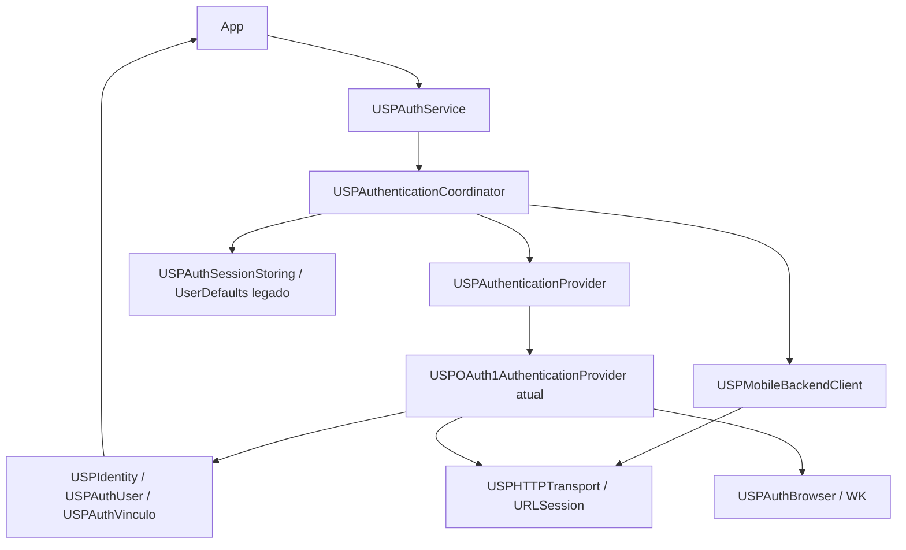

# Consolidação do USPAuthKit

> Organização física posterior: [iteração11](../11-auth-layout/walkthrough.md).
> Paths mencionados neste registro descrevem o estado antes desses moves.

2026-10-02, feature/auth-architecture-modernization. Consolidação concluída no
escopo pedido, sem commit, mudança pública, storage/endpoints, cliente ou OAuth2.
O working tree continua contendo as implementações/documentação da modernização
para revisão; "limpeza" aqui não significa descartar essas alterações ou publicá-las.

## Estado anterior e resultado

A fachada monolítica original conhecia tokens, assinatura, perfil, defaults, UI e
registro mobile. A composição implementada distribui responsabilidades privadas:

Fonte de verdade atual: [arquitetura](../../authentication/architecture.md).
SDK entrega autenticação, sessão local, perfil básico/vínculos, wsuserid e integração
mobile existente. Provider possui handshake/signing/token pair/verifier/nonce,
configuração específica consumer key/secret do app e request de perfil. AppKey/
endpoint/header mobile são configuração geral. wsuserid integra perfil, é
identificador/credencial operacional de recursos USP, não OAuth access token.

Não mantido wrapper USPMobileCredential redundante; backend usa user.wsuserid.
Store legado ainda suporta apenas schema OAuth1. Fake neutro prova o contrato de
autenticar + perfil completo sem credenciais/protocolo/browser OAuth; não implementa
ou define outro mecanismo. Modelo futuro de persistência/config depende de contrato.

## Limpeza da investigação

Removido arquivo privado Sources/USPAuthKit/Core/USPAuthDiagnostics.h e todos os
imports/calls USPAuthDiagnostic/[AuthDebug], helpers de URL/HTTP/header/estrutura,
serialização para traces, campos/variáveis exclusivos de impressão e bloco DEBUG
que repetia parsing do callback para diagnóstico. Simplificados getters de userData
/updateIdentity após remoção das leituras extras para imprimir contagens.

Afetados: Adapters/USPAuthService.m, Core/OAuth1Controller.m, USPAuthBrowser.m,
USPOAuth1AuthenticationProvider.m, USPAuthenticationCoordinator.m,
USPMobileBackendClient.m, USPAuthSessionStore.m. callbackConsumed permanece:
é estado funcional de handoff/correção, não flag de diagnóstico. Guard de URL nil,
validação e callbackRejectionReason permanecem lógica de validação, não logger.
Não alterado wire format, persistência, algoritmo, default provider ou clientes.

## Testes permanentes

Preservada suíte R02 inteira. Mantidos vetores OAuth1, transporte/store/mobile,
fake neutro e composição por instância; testes de regressão WK102 real com valores
sintéticos, acesso/perfil/registro/completion uma vez, erro102 antes do callback,
erro reentrante, token inválido/verifier/destino, cancel/logout e resultados tardios.

Mantidos testes de perfil: JSON original com dois vínculos, modelo/identity,
metadata/raw userData iguais (inclusive plural/aliases/extra fields), restauração,
round-trip tipado e caso plural-only legado. Nenhum parser corrigido por diferença
DEV/PROD. Browser failure sem URL permanece teste de comportamento, renomeado para
retirar "Diagnostic".

Removidos só dois testes exclusivos da infraestrutura de impressão:
- testTemporaryDiagnosticsNeverIncludeSecretsURLValuesOrErrorDescriptions
- testRelationshipDiagnosticsExposeOnlyStructureAndCounts

Não era teste de fluxo acoplado a helper: o erro browser sem URL tinha sua própria
verificação observável e foi preservado. Contagem iOS66→64 resulta dessas duas
remoções, não desativação de regressões úteis. Testes anteriores já reproduziram
falha do lifecycle antes da correção; nenhum defeito novo foi introduzido para
repetir artificialmente a evidência.

## Documentação e integração

README reestruturado no trecho Auth, preservando material Observability: requisitos,
SPM/local/release, configuração específica do app, Swift/ObjC, perfil/vínculos,
sessão local/logout, push/mobile, arquitetura e segurança. Exemplo incorreto de
wsuserid como Authorization universal retirado; contrato de request pertence ao
endpoint do app. Nenhum valor real novo de credencial/PII em exemplos.

Arquitetura canônica contém responsabilidades/config/provider/perfil e limites.
consumer-migration operacional organiza níveis A/B/C/D, APIs, checklist17passos,
rg por arquivos e migrações específicas do Cardápio. new-integration orienta apps
novos para configure→ensure→USPAuthUser/vinculos/wsuserid→logout, sem detalhes OAuth.
Auditorias/roadmap anterior identificados como histórico; topo do roadmap apresenta
status implementado/testado/homologado/pendente e links atuais. Inventário Cardápio
registra primeiro piloto e diferença DEV/PROD. Iterações08/09 preservam evidência
histórica com aviso de fechamento; não fingir que o agente executou login físico.

APIs recomendadas: shared/configure do mecanismo atual, ensure/currentUser/modelos,
wsuserid conforme recurso, updateNotificationToken, logout local/isLoggedIn local.
Compatíveis/evitar novo código: userData, tokens OAuth, loginInWebView, key reads,
isRegistered. Config/baseURL e register/check/invalidate permanecem úteis quando
necessários ao contrato, sem modelo genérico futuro inventado. Headers intactos,
sem annotations deprecated/breaking changes novas. Mudanças de segurança anteriores
(callback/cancel/late) são intencionais e documentadas; não foram revertidas aqui.

## Cardápio e domínio validados

Responsável homologou pacote local no iPhone: request200, authorization, callback
localhost correlacionado/verifier, access200, profile200/application-json/dictionary,
USPAuthUser/wsuserid, vínculos, persistência/restauração, registro200/completion,
identificador funcional em demais requests. DEV tinha vinculo:[]; PROD retornou
vínculos esperados. Nenhuma perda AuthKit; nenhuma correção de parsing aplicada.

Regressão real WK102 pós-callback cancelava access(-999). Corrigida pelo handoff de
ownership antes de policyCancel. Log temporário ajudou diagnóstico, mas cobertura
agora é permanente. Não extrapolar homologação a todos apps, push/variantes UI/
runtime14. Nenhuma alteração do Cardápio nesta tarefa.

## Validação final após limpeza

| Validação | Resultado |
|---|---|
| swift build host | Compilou, exit0,1,75s |
| swift test host | 65pass/1skip explícito UIKit,0fail; serviço não executado no host |
| Cross iOS15 --build-tests | Compilou/linkou, exit0,2,47s |
| Auth XCTest iOS27 | **64pass/0fail/0skip**,88,9s,zero warnings/errors do harness |
| R02/fake/provider/transport/store/coordinator/perfil/security | Incluídos na suíte iOS:24baseline +40arquitetura |
| Fixtures Swift/Objective-C | Compilaram/linkaram/executaram no teste R02 do product real |
| Checker público | Cinco headers inalterados |
| C ASan/UBSan | Quatro casos auditoria +dois vetores; entrada intacta/isolamento4threads |
| git diff --check | Aprovado |
| Busca diagnóstico Sources/Tests | Zero referências USPAuthDiagnostic/AuthDebug |

Bundle /tmp/uspauth-consolidation.xcresult. Logs efêmeros host-build/cross/host-test
/tmp/uspauth-consolidation-{build,cross,host-test}.log. Cache SwiftPM user-level
inacessível/readonly pelo sandbox em CLI; fallback/tmp funciona. Cross linker
avisa XCTestSDK17 versus target15; warnings já conhecidos, não aumento do mínimo.
Deployment declarado continua14, override15 só na invocação. Não executado runtime14.
Não houve nova homologação física depois da remoção de logs; confirmação anterior
do responsável e regressão executável após limpeza são as evidências distintas.

## Pendências e próxima tarefa

R02 e extrações R04–R09 implementadas/testadas; R12buffers concluído; R11 callback
válido homologado/cancel-late testados. Perfil canônico e piloto Cardápio no escopo
acima validados. R01lista completa, R03backend futuro, R10Keychain,
R13status/payload/atomicidade, R14logs legacy, R15policies, R16envelope/config futura,
R17CI/runtime14 e rollout de todos apps ainda pendentes. Sem TTL/refresh/revogação/
SSO, segundo provider, OAuth2/PKCE/scopes/discovery/bearer especulativo.

Única próxima tarefa: R03, especificar com responsável/backend contrato real de
mecanismo futuro +perfil/wsuserid/config por app/integração mobile. Não executar
nem modelar esse contrato nesta consolidação. Para adoção atual, seguir README e
checklist de migração; definir release/publicação separadamente, sem commit aqui.
