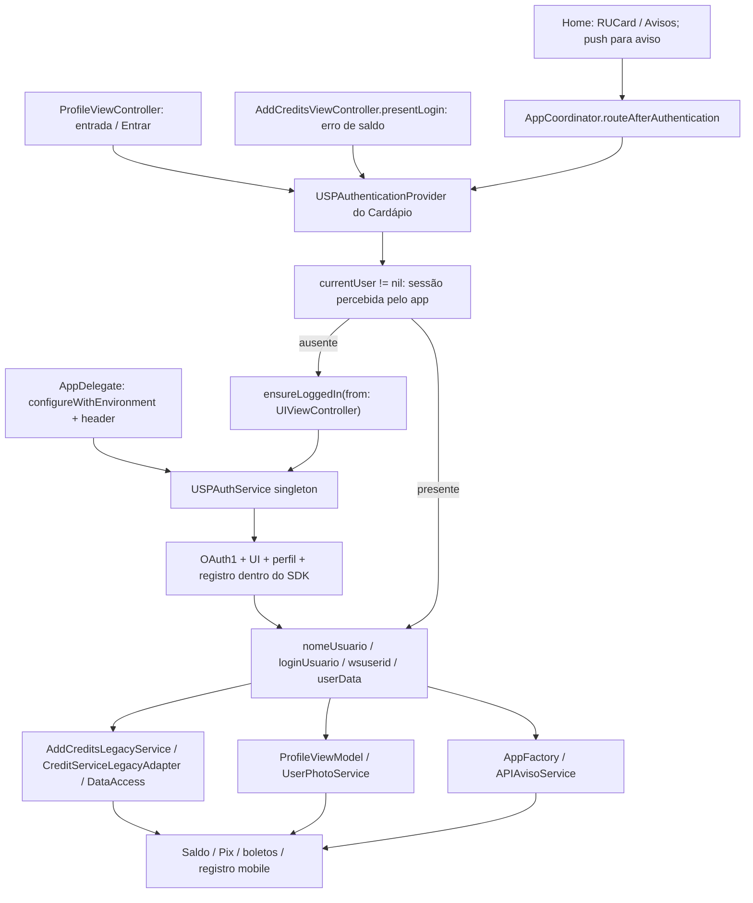

# Inventário dos consumidores do USPAuthKit — R01

Este documento complementa o [inventário público](public-api-inventory.md), a [arquitetura atual](current-architecture.md) e o [roadmap](modernization-roadmap.md). Auditoria estática em 2026-10-01; código e testes não alterados. Os sete documentos do baseline foram lidos antes da análise. [R02](validation.md#r02--testes-do-contrato-público-de-sessão) já executou 24 testes Auth no Simulator iOS27, incluindo 18 caracterizações novas e fixtures Swift/Objective-C. Essa evidência é do SDK atual, não uma execução do Cardápio ou da versão 1.4.5.

## Cardápio USP

### Escopo, integração e versão

- Local: `../Cardapio USP`, revisão Git `84e55bc65a7453951ad4f27b2829e9e5c3245bb6`, working tree limpo na leitura inicial e final. As referências abaixo são relativas a esse diretório; `App/`, `Core/` e `Features/` abreviam o prefixo `Cardapio USP/`.
- SPM remoto: `https://github.com/STI-USP/USPAuthKit`, requisito `upToNextMajorVersion` desde **1.4.5** (>=1.4.5, <2.0.0), em `Cardapio USP.xcodeproj/project.pbxproj:1350–1357`; product **USPAuthKit**, linhas 1399–1402. Não é uma referência local a USPMobileKit; não há `import USPMobileKit` ou product com esse nome no consumidor.
- Lock local: `Cardapio USP.xcodeproj/project.xcworkspace/xcshareddata/swiftpm/Package.resolved`, pin `uspauthkit` **1.4.5**, commit **5c3013df523630095a6bb89f9620c86a35e68b97**. Esse lock existe no disco, mas não está versionado no checkout analisado. A versão exata observada não garante que outra máquina resolva a mesma revisão. Nenhuma resolução/atualização foi executada.
- O product entra em **Frameworks do target Cardapio USP** (`project.pbxproj:56,260`); os targets `Cardapio USPTests` e `Cardapio USP Integration Tests` dependem do app hospedador e contêm callers Auth. `Cardapio USP UI Tests` exercita telas/launch arguments; não chama o SDK diretamente. A leitura dos objetos PBX confirmou ausência de outro linkage direto do product.
- Callers de execução **Swift e Objective-C**; mínimo do app declarado **iOS16.6** (não altera o mínimo iOS14 do SDK). Bridging headers do app e unit tests importam headers próprios; não importam headers internos do AuthKit. ObjC usa `@import USPAuthKit`, Swift usa `import USPAuthKit`.
- Imports ativos no app: `App/AppDelegate.m:17`, `App/AppFactory.swift:10`, `App/PRIPServiceConfiguration.swift:7`, `Core/Service/AuthenticationService.swift:10`, `Core/Service/DataAccess.m:17`, `Core/Service/DataModel.m:21`, `Core/Service/PushNotificationService.swift:11`, `Features/RUCard/Data/CreditService.swift:10`.

### Fluxo real e wrappers

`AppContainer.live()` compõe **USPAuthenticationProvider**, adapter do **próprio Cardápio**, que implementa `AuthenticationProviding` (`App/AppContainer.swift:57–70`; `Core/Service/AuthenticationService.swift:12–88`). Não é um provider de protocolo dentro do SDK: transforma usuário em `AuthenticatedUserSnapshot` e delega login/logout à fachada singleton.

Entradas e tratamento observável:

| Local | Contexto / finalidade |
|---|---|
| `App/AppCoordinator.swift:51–73,135–164,181–220` | RUCard, avisos e aviso aberto por push passam por gate de autenticação; impede rotas concorrentes, fornece controller atual; sucesso navega somente se o controller ainda é o mesmo; falha não navega/aciona onFailure |
| `Features/Home/Presentation/Coordinators/HomeRouting.swift:44–57,74–87` | StandaloneHomeRouter reproduz gates de créditos/avisos para Home isolada, tests/previews |
| `Features/Profile/Presentation/Views/ProfileViewController.swift:301–302,326–368` | Perfil inicia login automaticamente na entrada sem sessão e pelo botão Entrar; evita duplicação/apresentação sobre outra modal; atualiza UI e recarrega perfil no sucesso; falha deixa UI deslogada |
| `Features/RUCard/Presentation/Views/AddCreditsViewController.swift:84–94,181–185,420–435` | Entrada normalmente já autenticada pela Home; erro `DidReceiveLoginError` pede login novamente; sucesso recarrega saldo e nome |
| `Core/Service/AuthenticationService.swift:39–41,66–81` | `isAuthenticated` significa mock ativo **ou currentUser existente**, não `USPAuthService.isLoggedIn`; pode pular ensure em cache parcial. No callback ignora NSError, reduz resultado a Bool e aceita usuário em cache como fallback, voltando ao MainActor |
| `Features/RUCard/Presentation/ViewModel/AddCreditsViewModel.swift:40–62`; `Features/RUCard/Data/AddCreditsService.swift:21–46` | ViewModel chama AddCreditsLegacyService → CreditServiceLegacyAdapter para saldo; depois CheckoutDataModel → DataAccess para último Pix; erros viram mensagem no ViewModel |
| `Features/Profile/Presentation/ViewModel/ProfileViewModel.swift:63–113` | Recarrega nome/número/vínculos e foto; falha da foto mantém placeholder, sem encerrar sessão |

**Contrato importante de R02:** o app se apoia precisamente na existência de `currentUser` independente de um par OAuth completo. Trocar o getter por validação remota ou exigir tokens mudaria seus gates. `isLoggedIn` do SDK é estado local; o método homônimo de **DataModel do app** também usa `currentUser != nil`, não é o mesmo contrato. Não corrigir essas diferenças nesta auditoria.

### APIs efetivamente usadas em execução

| API / dados | Arquivo e linhas | Contexto / finalidade |
|---|---|---|
| `configureWithEnvironment:consumerKey:consumerSecret:appKey:` | `App/AppDelegate.m:84–90` | Bootstrap Dev/Prod, credenciais de configuração legada e identidade do app |
| `sharedService`, `backendHeaderValue` setter | `App/AppDelegate.m:91` | Aplica header mobile compartilhado com requests próprios |
| `shared()`, `currentUser()` | `Core/Service/AuthenticationService.swift:40,52–53,77–80` | Gate local, snapshot, ensure e fallback de sucesso |
| `ensureLoggedIn(from:completion:)` | `Core/Service/AuthenticationService.swift:77` | Única chamada ativa ao login público do SDK; recebe controller, user/error; erro descartado pelo adapter |
| `USPAuthUser.nomeUsuario`, `.loginUsuario`, `.wsuserid`; `userData` getter | `Core/Service/AuthenticationService.swift:55–58` | Snapshot de nome/login/identificador/perfil cru consumido pela apresentação e foto |
| `shared()`, `logout()` | `Core/Service/AuthenticationService.swift:86` | Limpeza local delegada ao SDK |
| `shared()`, `config` getter | `App/AppFactory.swift:145`; `Features/RUCard/Data/CreditService.swift:202–210` | Ambiente de avisos; baseURL/appKey do registro próprio |
| `USPAuthConfig`, `.environment` e enum `.dev/.prod/.custom` | `App/PRIPServiceConfiguration.swift:194,200–208` | Alinha avisos autenticados ao ambiente emissor; custom conserva ambiente solicitado |
| `shared()`, `currentUser()?.wsuserid` | `App/AppFactory.swift:166` | Closure tokenProvider dos avisos, avaliada ao construir requests |
| `sharedService`, `currentUser` | `Core/Service/DataModel.m:111` | `DataModel.isLoggedIn` considera somente perfil presente |
| `sharedService`, parâmetro `USPAuthService` | `Core/Service/DataAccess.m:110,159–160,515` | Resolver de credencial de saldo recebe fachada concreta |
| `currentUser`, `USPAuthUser.wsuserid` | `Core/Service/DataAccess.m:197–198,221–222,306–307` | Geração Pix, último Pix, boletos pendentes |
| `currentUser`, `userData`, `.wsuserid` | `Core/Service/DataAccess.m:516–523` | Saldo: candidatos wsuserid model/raw, loginUsuario, codpes |
| `shared()`, `currentUser()` | `Features/RUCard/Data/CreditService.swift:101` | Guard para saldo, seguido de resolução de credencial |
| `shared()`, `currentUser()?.wsuserid`, `userData` | `Features/RUCard/Data/CreditService.swift:176–187` | Resolver Swift equivalente para saldo, deduplicação e registro |
| `USPAuthConfig.baseURL`, `.appKey` | `Features/RUCard/Data/CreditService.swift:202–210` | Monta registro mobile próprio, não assina OAuth |
| `shared()`, `updateNotificationToken(_:)` | `Core/Service/PushNotificationService.swift:210–220` | FCM token persistido pelo app e repassado ao SDK |

**Sem chamada ativa no app:** `init`, `initWithUserDefaults:`, `configureWithConfig:`, Swift `configure(with:)`, `USPAuthService.isLoggedIn`, `currentWSUserId`, `loginInWebView`, `oauthToken`, `oauthTokenSecret`, setters `appKey/config/notificationToken/notificationPlatform`, getters `notificationToken/notificationPlatform`, `registerToken`, `invalidateToken`, `checkToken` (com ou sem completion), `USPAuthVinculo` e `USPAuthUser.initWithDictionary`. O app usa o nome Swift `shared()` e os getters/métodos acima; configuração de execução é ObjC. Ausência de uso neste app não autoriza remover APIs para outros consumidores.

`Core/Service/ServiceWrapper.swift:1–51` é inteiramente comentado: as referências a `sharedService()`, currentUser/userData e pseudo OAuthAuthService **não são callers compilados**. `Constants` carrega URLs com nomes OAuth, mas não há uso delas no handshake do app; ele fica no SDK.

### Testes e suporte de testes do consumidor

Os testes também fazem parte do custo de compatibilidade, mas não representam operação com credencial real. Não foram alterados nem executados aqui.

| Arquivo (relativo à raiz Cardápio) | Linhas / contrato exercitado |
|---|---|
| `Cardapio USPTests/Services/DataAccessTests.m` | import:6; logout/limpeza:172–173,196–197; sharedService/setters oauthToken/oauthTokenSecret:181–183; perfil JSON sintético via defaults:185–191; testes de destinos wsuserid:257,282 |
| `Cardapio USP Integration Tests/Flow/CreditFlowIntegrationTests.m` | import:14; defaults isRegistered:62,85,136; sharedService e setters OAuth:180–182; gravação direta JSON userData:184–192; reset do domínio:39,51 |
| `Cardapio USPTests/Swift/AddCreditsViewControllerComponentTests.swift` | import:2; shared/logout/limpeza:9–11,22; setters OAuth:23–24; JSON userData/isRegistered:26–31 |
| `Cardapio USPTests/Swift/CreditServiceLegacyAdapterTests.swift` | import:4; defaults/limpeza:191–205,243–244; setters OAuth e perfil JSON:213–222; asserts isRegistered:313,328,342,356; swizzling:28–41 **de DataAccess**, não do AuthKit |
| `Cardapio USPTests/Swift/ProfileViewModelTests.swift` | import:3; identifier sintético:66,79,93; shared/setters OAuth/JSON defaults:121–127; logout/limpeza:131–133 |
| `Cardapio USPTests/Swift/PRIPEnvironmentConfigurationTests.swift` | import:2; `USPAuthConfig.dev(withConsumerKey:consumerSecret:appKey:)`:176–180; `.prod(...)`:192–196,208–212; confirma configuração de avisos |
| `Cardapio USPTests/Services/AuthConfigurationTests.m` | ambiente via Constants:21–23; não configura SDK diretamente |
| `Cardapio USPTests/Swift/AuthTestModeTests.swift` | keys diretas:8–9; salva/restaura userData:32,39,55,60,74,81 e verifica suporte de launch arguments |

`Core/Service/AuthTestMode.swift:13–14,42–54,65–76,93–95` é suporte **compilado no app**, condicionado a argumentos de testes: remove/escreve `isRegistered` e `userData` (NSData JSON), além de flags próprias. Não semeia o par OAuth. Fora de teste, limpa só flags próprias (:59–62). O mock pode continuar marcando autenticação após SDK.logout porque o adapter consulta a flag mock e logout não a limpa; é limite do modo simulado, não prova de falha do logout em uso real.

### Identidade e destino de wsuserid

Origem efetiva: `currentUser().wsuserid` / `userData["wsuserid"]`, não `currentWSUserId()` (não chamado) e não oauthToken. A assinatura/forma do valor não é interpretada pelo consumidor. É uma **credencial opaca funcional do backend mobile**, enviada para obter dados/operações do usuário; o código a chama token. Não há evidência de que seja OAuth access token, bearer padronizado, número USP, nem contrato de validade/rotação confirmado pelo servidor. Comentários `Token OAuth para API` em DataAccess:198,222,307 não mudam essa conclusão.

| Origem → transformação | Request / endpoint | Finalidade e evidência |
|---|---|---|
| wsuserid model → raw wsuserid → loginUsuario → codpes; primeiro não vazio | POST JSON `BASE_URL + consultarSaldo`, campo `token` | Saldo RU; Swift resolve somente strings (`CreditService.swift:175–190`); ObjC converte NSNumber em string (`DataAccess.m:94–101,515–539`); envio :179–183. Fallback a login/codpes **não é equivalência de credenciais comprovada** |
| Mesmo resolver Swift | POST JSON `config.baseURL + /mobile/servicos/oauth/registrar`, campo `token` | Registro mobile próprio (`CreditService.swift:193–264`); inclui appKey, push vazio, ambiente I/platform F, logParams opcionais; retry sem logParams após401/403; aceita só200 e grava isRegistered |
| currentUser.wsuserid, sem transformação | POST form `BASE_URL + pixgerar` e `BASE_URL + pixlistar`, campo `token` | Criar/recuperar Pix; inclui parâmetro auxiliar de backend e valor/tipoapp quando aplicável (`DataAccess.m:196–240`). Valores auxiliares não reproduzidos |
| currentUser.wsuserid, sem transformação | POST JSON `BASE_URL + boletosEmAberto`, campo `token` | Boletos pendentes (`DataAccess.m:305–324`). Método existe; callers externos ao fluxo atual não foram presumidos |
| snapshot.identifier → raw wsuserid → loginUsuario → codpes; trim/primeiro não vazio | POST JSON `/mobile/servicos/ecard/fotoCartao`, campo `token` | Foto: `ProfileViewModel.swift:90–103,187–204`; `UserPhotoService.swift:81–100,176–189`. Origem endpoint :205–277: PROFILE_PHOTO_ENDPOINT opcional, senão host de BASE_URL, senão prod |
| closure currentUser.wsuserid → trim | GET `/mobile/servicos/notificacoes`; POST `/mobile/servicos/notificacoes/{id}/leitura`, header **Usp-Mobile-Key** | Listar avisos e marcar leitura; `AppFactory.swift:163–167`; `AvisoService.swift:177–226`; hosts Dev/Prod escolhidos por `PRIPServiceConfiguration.swift:148–152,189–209` |

`BASE_URL` resolve para `https://dev.uspdigital.usp.br/mobile/servicos/cardapio/` no Debug e `https://uspdigital.usp.br/mobile/servicos/cardapio/` no Release. `DataAccess.m:380–417` concatena path e aplica JSON/form + headers próprios; não assina esses requests OAuth1. As URLs documentadas não contêm credenciais.

Outros destinos:

- **Cache/deduplicação de saldo em memória:** chave é o valor resolvido, `BalanceRequestCoordinator` (`CreditService.swift:31–70,110–115`), cooldown1s. Não há invalidação desse coordinator no logout observado; `resetDedupStateForTesting` é hook de testes. Registrar comportamento sem corrigir.
- **Foto em memória/disco:** credencial trim indexa cache; nome do arquivo deriva de SHA256(token), sob caches/UserPhotos (`UserPhotoService.swift:91,124–127`; `UserPhotoCache.swift:20–45,54–79,140–145`). Hash aqui é cache, não assinatura OAuth. Logout limpa fotos.
- **Persistência:** o app não grava um campo wsuserid separado em produção; SDK guarda no perfil; testes/AuthTestMode semeiam JSON diretamente. Snapshot guarda identidade/perfil em memória.
- **Apresentação:** ProfileViewModel usa identifier como último fallback para número USP **somente se numérico** (:75–80,222–228); não comprova que a credencial seja número institucional. Nome/login são campos tipados; vínculos são lidos do dicionário cru (`vinculo/vinculos`, nome/tipoVinculo, nome/siglaUnidade, tipoUsuario e aliases :231–258). Não usa objetos USPAuthVinculo nem campos tipados de email/telefone.
- **Diagnóstico:** prefixo da credencial resolvida vai a print (:119) e a NSLog/Crashlytics como fingerprint prefixo+comprimento (`DataAccess.m:560–579`). É exposição parcial de credencial/identidade, não hash seguro ou uso anônimo comprovado. Não reproduzimos valores; não corrigimos logs nesta tarefa. Nenhum uso observado como ID de Firebase Analytics, associação persistida de conta ou Authorization OAuth.

### Storage e risco para R05

| Fronteira | Evidência | Impacto |
|---|---|---|
| API pública `userData` | AuthenticationService:58; DataAccess:517; CreditService:178 | Preservar shape de NSDictionary, wsuserid/login/codpes e dados usados pelo perfil |
| **Key direta `userData`** | `DataModel.m:114–120` | Getter do modelo próprio lê NSUserDefaults.standard como NSData JSON após gate currentUser. Nenhum caller ativo desse getter foi encontrado no app rastreado; ainda é dependência compilada e potencial uso indireto |
| **Key direta `isRegistered` em execução** | `CreditService.swift:121–126,252–255` | Decide registrar e escreve true após200; bypass da fronteira de store do SDK. Mudança de key/escopo/Keychain pode causar divergência/registro repetido |
| Keys diretas em suporte/tests | AuthTestMode e tabela anterior | Novo storage quebraria semeadura/limpeza de sessão sintética e testes, mesmo mantendo propriedades públicas |
| FCM próprio | `PushNotificationService.swift:100,215` | Key **push.fcm.token**, diferente de notificationToken do SDK; mantida pelo app, não removida pelo logout do SDK |

Não foram encontrados accesses diretos às keys `oauthToken`, `oauthTokenSecret`, `notificationToken`, `notificationPlatform` no código próprio rastreado. Os setters OAuth encontrados são **propriedades públicas usadas em testes**, não acesso por string às keys. Sem migração/limpeza manual de tokens em execução, Keychain próprio para Auth ou reset de domínio no logout real. Resets de domínio existentes são testes. R05/R10 precisam de estratégia explícita para esses leitores/escritores externos, sem assumir que preservar selectors basta.

### OAuth1, UI e runtime

**Classificação principal D**, por dependência de persistência interna e estado legado; **B na superfície funcional**, por APIs complementares/config/backend mobile. Não é C no código de execução: não manipula oauthToken/oauthTokenSecret, verifier, nonce, request/access token, HMAC ou Authorization OAuth. Consumer key/secret na configuração suportada não é prova de manipulação do protocolo. Testes dependem explicitamente do par OAuth para montar sessão, e precisam ser considerados no rollout.

**O Cardápio controla o ponto de apresentação, não o mecanismo visual da autenticação.** Ele fornece UIViewController, controla gates/modais/navegação/retry e recebe completion. Não chama loginInWebView, não cria WKWebView para login, não segue callback OAuth/deep link de autenticação. Sua `Features/ServicosPRIP/Presentation/Views/WebViewViewController.swift:19–24,65–87` tem WKWebView para links/banners/PRIP/política, roteada por `AppCoordinator.swift:76–101,126–132`; não recebe par OAuth nem substitui UI do AuthKit. Portanto outro browser pode ficar dentro do SDK, preservados apresentação, cancelamento, completion e navegação compatíveis.

Não encontrados subclasses/categorias de USPAuthService/User/Config/Vinculo, imports internos, KVC, NSClassFromString/NSSelectorFromString/performSelector/swizzling sobre AuthKit. Há KVC/runtime no app/testes sobre restaurante, Pix, DataAccess e UIKit, sem relação com classes Auth. Bridging é entre módulos próprios Swift/ObjC. Ausência na busca estática não certifica binários externos/runtime servidor, mas não há evidência local dessa dependência.

### Push e backend mobile

FCM/APNs ficam no serviço próprio. AppDelegate encaminha APNs à AppFactory (`AppDelegate.m:129–142`); PushNotificationService recebe FCM via refresh/delegate e chama `updateNotificationToken` (:199–220,235 em diante). Não acessa notificationPlatform ou notificationToken diretamente. SDK mantém sua operação de persistência/registro associada ao update; não mudar esse efeito na separação futura.

Não chama `USPAuthService.registerToken/checkToken/invalidateToken`. **Isso não significa ausência de backend mobile:** CreditService implementa seu próprio registrar e compartilha `isRegistered`, config.baseURL/appKey e headers com o SDK. Avisos usam a credencial mobile em header. Separar Authentication Provider de Backend Mobile Client internamente é viável se a fachada mantiver configuração, credencial/perfil, updateNotificationToken e efeitos de registro; remover/substituir esses contratos ou isRegistered silenciosamente não preserva esse consumidor. O path com `oauth/registrar` é contrato mobile observado, não prova de assinatura OAuth pelo caller.

### Logout e expectativa observada

Fluxo: **Perfil → Sair → confirmar → ProfileViewModel.logout → limpar foto/cache + CheckoutDataModel.pix + UserDidLogout → USPAuthenticationProvider.logout → USPAuthService.logout → router volta à tela anterior**.

Evidências: `ProfileViewController.swift:305–319`; `ProfileViewModel.swift:116–125`; `ProfileSessionCleaner.swift:19–21`; `AuthenticationService.swift:85–86`; `AppCoordinator.swift:103–105`. `AddCreditsViewController.swift:188–198` limpa UI/saldo/último Pix ao observar evento; `MenuViewController.m:184–190,247` observa evento próprio, com handler atualmente vazio. `UserDidLogout` é produzido pelo app **antes** de limpar a sessão SDK; `DidRegisterUser` é listener legado (:168) sem chamada pública de notificação AuthKit (não inventar contrato novo do SDK).

Expectativa inferível: **limpar sessão local e estado visual/de pagamento/foto**. Não há invalidateToken, revogação, logout de backend próprio, limpeza de cookies ou encerramento SSO nesse fluxo. Não afirmar intenção de produto além do código. R02 prova logout local do SDK e limpeza de push/plataforma; app conserva sua key FCM, coordinator de saldo não é resetado e callbacks tardios não foram exercitados nesta auditoria. Não alterar esses comportamentos.

### Configuração sem exposição de valores

| Entrada | Origem / finalidade |
|---|---|
| Ambiente SDK | Build settings Debug=dev/Release=prod → Info.plist `USP_AUTH_ENVIRONMENT` → Constants:37–38 → AppDelegate:84–90; qualquer outro texto cai em prod |
| consumerKey | Literal no bootstrap AppDelegate:88; configuração OAuth1 suportada; valor omitido |
| consumerSecret | Build settings `OAUTH_CONSUMER_SECRET` em `Cardapio USP.xcodeproj/project.pbxproj:1024,1089` → placeholder `Cardapio USP/Supporting Files/Cardapio USP-Info.plist:124–125` → Constants:36 → AppDelegate:89; literal embarcado, não secret recebido em runtime; valor omitido |
| appKey | Literal AppDelegate:90; identificação do app para registro; valor omitido. CreditService lê `config.appKey` |
| backendHeaderValue | `AppHTTPMobileHeaderValue` definido no código `Core/Network/AppHTTPHeaders.m:8–12`, aplicado à fachada e requests próprios; valor omitido, papel de autorização servidor não demonstrado |
| baseURL/custom | Nenhuma custom config de execução; ambiente fornece base do SDK. BASE_URL do app é build setting/plist separado, usado pelo saldo/Pix/boletos e origem da foto; avisos alinham ambiente pela config do SDK |
| URLs OAuth legadas | Constants:34–35,39 lê OAUTH_SERVICE_URL/OAUTH_URL/USER_URL_STRING do plist; não são passadas ao SDK nem há handshake caller próprio observado |

Sem xcconfig rastreado. Não foi encontrada origem alternativa por environment/secrets para configuração Auth de execução; settings literais e plist são a evidência disponível. Variáveis/arguments `PRIP_ENV`, `AVISOS_ENV`, `BANNER_ENV` controlam serviços próprios, não substituem configure Auth. Tests/bootstrap hospedado pode pular configuração (`AppDelegate.m:65–69`); não confundir com execução normal.

### Impacto da arquitetura futura e piloto

**Impacto global: alto risco se a modernização trocar storage/semântica sem compatibilidade**, devido a keys diretas e registro próprio. A camada de login é potencialmente transparente: App → adapter próprio → USPAuthService → coordenador/provider interno pode continuar sem expor qual provider está ativo.

A transparência **OAuth1 → OAuth2 é condicional, ainda não demonstrada**. Precisa preservar perfil e currentUser/cache semantics, `userData`/campos usados, uma credencial mobile aceita por saldo/Pix/foto/avisos, config/environment/baseURL/appKey/header e push/local logout. Não substituir wsuserid por access token OAuth2. Configuração antiga permanece selecionando OAuth1; seleção do mecanismo novo/config neutra poderá exigir adaptação aditiva quando houver contrato real. Leitura do storage exigirá estratégia compatível ou migração consciente do consumidor; não basta alterar provider.

| Piloto | Avaliação |
|---|---|
| Arquitetura desacoplada **ainda OAuth1** | **Bom candidato controlado:** integração real híbrida, adapter de UI simples, gates de navegação testáveis, backend/push/storage representativos. Valida mais do que fixture de import. Não é o consumidor de menor risco; preservar paridade e auditar caminhos legados e suporte de testes |
| OAuth2 posterior | **Candidato condicionado a R03**: credencial/perfil e endpoints mobile devem funcionar; sem isso, autenticar pode ter sucesso e todas as funcionalidades autenticadas falharem. Não usar como piloto para provar apenas browser/login |
| Rollback | Requisito remoto <2 permite atualização de minor, mas falta lock versionado. Planejar revisão/release conhecida e reautenticação, proteção de upgrade/downgrade/schema. Nenhum feature flag de seleção provider nem plano ensaiado foi encontrado; retorno ao provider1 não é conversão automática de token |
| Representatividade | Swift+ObjC, perfil, pagamentos, cache, push e keys legadas. Não representa consumidores que controlam loginInWebView, assinam requests ou usam runtime/headers internos |

Contratos a validar no piloto futuro: navegação/cancelamento e MainActor; cache parcial sem rede automática; dados de perfil; credencial nos seis destinos da tabela; registro/push antes/depois do login; sessão restaurada; logout local e UI; upgrade/downgrade do storage. R02 protege sessão/fachada/fixtures, **não comprova esses requests reais, UI ou backend do Cardápio**.

### Lacunas e status de R01

**Cardápio auditado; R01 parcialmente concluído.** É o único consumidor efetivamente auditado nesta etapa. O contexto inicial informa múltiplos apps, e o diretório pai contém outros projetos de apps (por exemplo e-Card, Bibliotecas USP, Jornal USP, Guia USP). A existência dessas pastas **não comprova dependência de USPAuthKit**: não foram auditadas. Não há lista autoritativa de consumidores/versões nem confirmação de que Cardápio seja o único relevante.

Faltam para fechar R01/gate de consumidores da Fase0:

1. Lista de consumidores mantidos confirmada pelas equipes, incluindo distribuídos fora deste workspace; auditar os que usam AuthKit e registrar exclusões comprovadas.
2. Inventário por revisão/versão e classificação, especialmente apps com tokens/WK/runtime/storage; confirmar uso indireto do getter DataModel.userData quando aplicável.
3. Paridade de consumo da revisão atual do SDK com 1.4.5 observada e release realmente distribuída do Cardápio; o lock local não identifica a versão instalada pelos usuários.
4. Para declarar migração transparente, R03 precisa confirmar emissão/validade/escopo de wsuserid ou credencial equivalente e aceitação em registro, saldo, Pix, boletos, foto e avisos. Fallback login/codpes e prefixos em diagnóstico são comportamentos conhecidos, sem validação remota.

Não houve login, tráfego remoto, build/test do consumidor ou resolução SPM. Não foram examinados resultados antigos/SDKs em TestResults como evidência de callers atuais. Esta análise não verifica expiração/rotação, autorização real, cancelamento ou comportamento de requests tardios. O mínimo iOS14 do SDK segue a limitação de R02 registrada na validation.

**Única próxima tarefa recomendada: continuar R01, levantando com as equipes a lista autoritativa dos consumidores e auditando o próximo consumidor confirmado.** R02 já protege o contrato local, mas este primeiro consumidor revela que compatibilidade de API não cobre storage externo; fechar essa lacuna antes de R04–R08 evita projetar store/provider com premissas falsas. R03 continua gate obrigatório futuro, sem ser implementado aqui.
