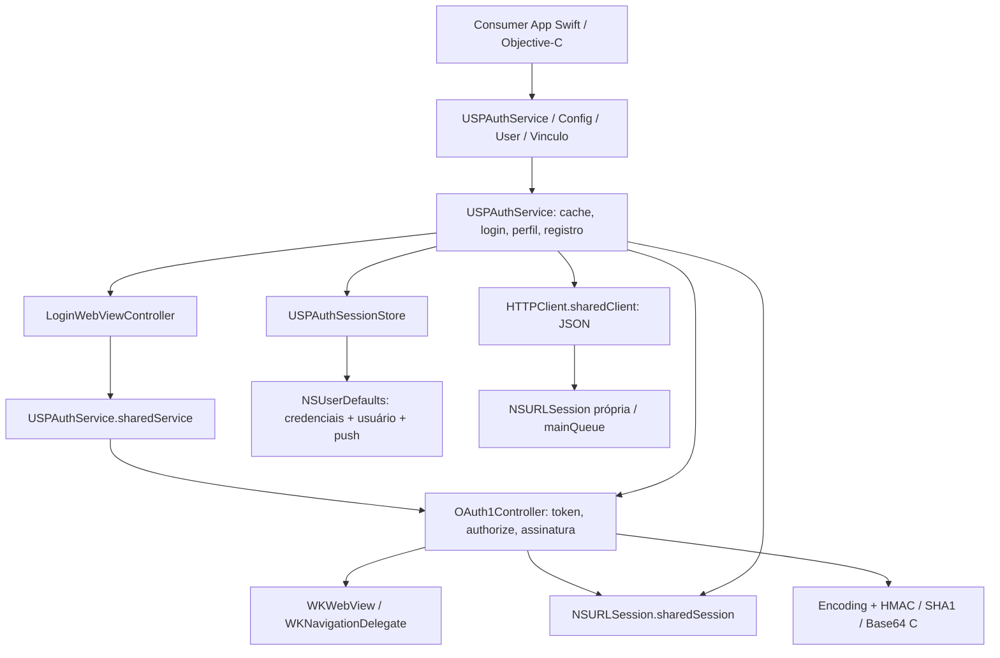

# Arquitetura atual do USPAuthKit — baseline anterior à modernização

> Registro do baseline anterior à extração. A arquitetura efetivamente implementada está em [docs/authentication/architecture.md](../authentication/architecture.md); headers públicos permanecem intactos.

Auditoria em 2026-10-01, commit `11d9582`. Documento principal: [roadmap](modernization-roadmap.md). A fonte de verdade é o código desta revisão, não os walkthroughs históricos.

## Escopo e evidência

O repositório é **USPMobileKit**; USPAuthKit é um product/module independente. Foram lidos todos os headers e implementações de Auth, manifest, README, testes, manifests de privacidade e documentação de iterações. Não existem apps consumidores neste workspace: uso externo de seletores, keys de defaults, runtime ObjC, subclasses e categorias permanece desconhecido. O README prova o contrato recomendado; os testes provam apenas os usos locais descritos adiante. Não foi realizado login real, acesso ao backend ou pentest.

## Package e dependências

| Item | Estado observado |
|---|---|
| Manifest | `Package.swift`, tools 6.1; usa Foundation/ProcessInfo para ler `SWIFT_ACTIVE_COMPILATION_CONDITIONS` e definir DEV |
| Plataforma declarada | iOS 14; toolchain disponível Swift 6.4 / Xcode 27.0 (27A266a) |
| Products | `USPAuthKit`, `USPObservabilityKit`, ambos libraries sem tipo estático/dinâmico fixado |
| Targets | Auth ObjC/C; Observability Swift em language mode 6; três targets de testes Swift |
| Dependências SPM | Nenhuma; Auth e Observability não dependem um do outro |
| Sistemas | Foundation, UIKit, WebKit, Security, dispatch; C usa libc/libm |
| Recursos | `PrivacyInfo.xcprivacy` processado por cada target; sem storyboard ou assets de Auth |
| Headers públicos | Cinco arquivos em `Sources/USPAuthKit/include`; umbrella `USPAuthKit.h` |
| Headers internos | Core/UI/Adapters visíveis à compilação interna via headerSearchPath; não exportados pelo umbrella |
| Código incorporado | HMAC (2008), SHA1 e Base64 (2003), wrapper Keychain com licença Apple (2010); não são dependências SPM, mas exigem manutenção e preservação de licenças |
| CI/lint/scripts | Não encontrados `.github`, GitLab CI, Makefile, scripts ou configuração de lint no inventário versionado |
| Versionamento | Tags locais 1.0.0–2.1.1 (com lacunas); release notes de observabilidade. Não inferir política SemVer só pelos números |

### Organização

`Adapters/USPAuthService.m`: fachada pública e orquestração. `Core/OAuth1Controller.m`: fluxo OAuth, browser delegate, transporte e assinatura. `Core/USPAuthSessionStore.m`: defaults. `Core/HTTPClient.m`: POST JSON. `Core/USPAuthConfig.m`: factories. `Core/USPAuthUser.m` e `USPAuthVinculo.m`: modelos. `UI/LoginWebViewController.m`: UI programática. `Adapters/USPAuthKitMutableURLRequest.m`: helper legado com headers fixos, sem referência no fluxo. `Core/KeychainItemWrapper.m`: compilado, sem referência no fluxo. `Core/OAuthConfig.h`: somente comentários, sem configuração efetiva.



## Fluxo efetivo

```mermaid
sequenceDiagram
  participant A as App
  participant S as USPAuthService
  participant V as LoginWebViewController
  participant O as OAuth1Controller
  participant B as Backend
  A->>S: ensureLoggedInFromViewController:completion:
  alt Tokens em memória e currentUser presentes
    S-->>A: usuário em cache (main thread)
  else Sem cache suficiente
    S->>V: apresentar UINavigationController
    V->>S: sharedService.loginInWebView
    S->>O: loginWithWebView
    O->>B: POST request_token assinado
    O->>V: carregar authorize com token e callback
    V-->>O: navegação com oauth_verifier
    O->>B: POST access_token assinado
    O-->>S: dicionário de parâmetros
    S->>S: persistir token e secret
    S-->>V: sucesso da etapa OAuth
    V-->>S: loginCompletion; dismiss
    S->>B: POST usuariousp assinado
    S->>S: persistir userData
    S->>B: POST registrar com wsuserid e push
    S-->>A: usuário ou erro de registro
  end
```

O diagrama representa o caminho normal; não há transação atômica. Se a busca de perfil falhar, tokens já ficam persistidos. Se o registro falhar, userData e tokens continuam presentes: nova chamada a ensure pode devolver sucesso por cache, sem refazer registro. `isRegistered` é escrito após 2xx, mas não participa da validade nem da decisão de ensure.

### Sessão e logout

`initWithUserDefaults:` restaura token/secret/push; `userData` é lido do store sob demanda. `hasValidSession` = tokens não vazios + dicionário de usuário não vazio. Não verifica wsuserid, prazo ou validade no servidor. `ensure` usa getters de tokens em memória + `currentUser`, enquanto `isLoggedIn` consulta o store: mudanças externas dos defaults podem fazê-los divergir. `currentUser` pode existir sem tokens, pois só exige cache. `currentWSUserId` aceita string vazia e não exige sessão válida.

`loginInWebView` executa **apenas OAuth**, sem perfil/registro; não equivale a ensure. Não há refresh, expiração, renovação automática, revalidação no startup ou deep link via AppDelegate/SceneDelegate. `checkToken` consulta o backend mobile e retorna JSON, sem atualizar ou invalidar a sessão. Não assumir que esse endpoint valida a credencial OAuth.

`logout` é síncrono/local: remove tokens, userData, flag e push, restaura plataforma F; não chama invalidar, não revoga OAuth, não cancela tarefas, não libera o controller ativo e não limpa cookies WKWebView. Operações tardias podem repovoar o estado após logout. `invalidateToken` é uma chamada separada com wsuserid/app e não limpa cache local.

### UI e lifecycle

Somente WKWebView, sem Safari/SFSafariViewController/ASWebAuthenticationSession. O controller instala `navigationDelegate`, substituindo o delegate do app. Callback usa `webView.URL`, não `navigationAction.request.URL`; detecta substring de verifier sem validar destino ou token pendente. Não implementa falhas de navegação. UI começa em todo `viewDidAppear`; Cancelar chama completion sem cancelar OAuth/transporte. Dismiss interativo em iPad não tem tratamento específico. Não há garantia global de completion única, nem API pública de cancelamento.

`LoginWebViewController` acessa singleton no init e no login. Uma instância criada pelo initializer público com defaults isolados apresenta UI que autentica o singleton, mas depois busca perfil na instância original. Isso compromete composição e testes. `disposeWebView` é declarado em header interno e não implementado (warning iOS confirmado).

## Networking

| Responsabilidade | Implementação / limite |
|---|---|
| Request/access token | OAuth1Controller cria NSMutableURLRequest + Authorization; sharedSession direto; parse form; ignora status HTTP |
| Perfil | Service usa preparedRequestForPath + sharedSession; JSON dictionary não vazio; ignora status HTTP e tipos dos campos |
| Mobile registrar/invalidar/consultar | Service monta body/path/header; HTTPClient serializa JSON; postBody valida 200–299 |
| Transporte | HTTPClient aceita initWithSession, mas Service fixa sharedClient e sharedSession e OAuth fixa sharedSession |
| Headers | OAuth Authorization; JSON Content-Type; header backend configurável com default fixo; helper legado também fixa User-Agent |
| Configuração | defaultSessionConfiguration e sharedSession; sem timeout explicitamente definido, política própria de cache ou sessão efêmera |
| Redirects / TLS | comportamento padrão URLSession/WebKit; sem delegate de redirects, pinning, allowlist ou bypass de TLS encontrado |
| Retry | sem política de retry própria |
| Cancelamento | tasks iniciadas sem handle retornado/retido; Cancelar UI e logout não cancelam rede |
| Threading | OAuth retorna rede na main; HTTPClient default usa mainQueue; service encaminha completions à main; JSON de perfil/store processado na main |
| Concorrência | boolean de apresentação por instância protege apenas ensure; propriedades nonatomic, login direto desprotegido, sem isolamento de estado |
| Erros | NSError: domínio USPAuthService com códigos privados 1000–1007 ou status HTTP; domínio oauth 0/100/101; LoginWebViewController NSUserCancelledError/-2; NSError de transporte propagado |

Separação fluxo → request de protocolo → transporte é parcial. HTTPClient não atende requests assinadas arbitrárias e não centraliza as três rotas. Não migrar automaticamente para async/await; callbacks ObjC e iOS 14 fazem parte da compatibilidade.

## Parsing, persistência e contrato

Parser OAuth usa NSURLComponents; ignora nomes vazios/valores ausentes, mantém valores vazios e último duplicado. `#_=_` é tratado no callback. Duas rotinas de encoding/signature normalization usam character sets diferentes e ordenação case-insensitive. PreparedRequest inclui todos os parâmetros em Authorization e, para POST, também escreve queryParameters no body sem Content-Type de formulário. Sem chamadas locais com queryParameters não nulos: generalização deve ser testada antes de reutilizar.

User converte campos textuais ausentes/NSNull/não-string em string vazia e ignora vínculos não-dicionário. Vinculo faz integerValue diretamente: NSNull ou tipo incompatível em códigoSetor/códigoUnidade pode causar exceção. `description` de User inclui nome e wsuserid. Não existem notificações NSNotification nem delegates públicos; callbacks são blocos anônimos. WKNavigationDelegate é interno.

Defaults: `oauthToken`, `oauthTokenSecret`, `notificationToken`, `notificationPlatform`, `userData` (NSData JSON), `isRegistered`; sem namespace/versão/ambiente/conta. Keychain wrapper presente **não protege a sessão atual**. Não foram encontrados logs explícitos de OAuth secrets, mas description e localizedDescription criam caminhos de vazamento.

## Testabilidade e baseline

66 métodos XCTest locais: 6 Auth (3 mapeamento de usuário, 1 factories, 2 parser), 59 Observability e 1 compatibilidade (imports + XCTAssertTrue). Não há testes ObjC dedicados, fluxo/login/logout/persistência/HTTP/assinatura/UI. Cobertura percentual não medida; não confundir contagem com cobertura.

Dependências substituíveis parcialmente: defaults público e session no HTTPClient interno. Dependências difíceis: singleton da UI/service, sharedSession OAuth/perfil, NSDate, NSUUID, WKWebView, SecItem no wrapper. Parser testado por NSClassFromString/perform em vez de acesso direto ao header interno. Tests no host não instanciam USPAuthService: sua implementação é excluída sem UIKit.

Resultados e comandos completos: [validação](validation.md). Builds host e iOS 15 passaram; 66 testes host passaram. iOS 14 falhou por mínimo do SDK 27, não por alteração de código. Execução iOS e apps reais continuam pendentes.

## Qualidade e próximos limites

O README anterior imprimia wsuserid, descrevia cache como sessão válida e usava um label Swift de configure que falha na toolchain atual. Nesta entrega os exemplos e as descrições de validade local/logout foram corrigidos documentalmente; o comportamento do SDK permanece igual. Não há app exemplo executável; factories e modelos têm init herdado de NSObject sem proteção contra configuração incompleta. Umbrella declara constantes de versão sem definição encontrada. DEV é SwiftSetting num target ObjC/C e não há uso dessa condição em Auth: não considerar mecanismo de seleção de ambiente válido.

Manter products independentes, tools/deployment e ausência de dependências externas. Criar um core compartilhado com observabilidade não tem benefício comprovado. Política SemVer precisa tratar seletores ObjC, nomes importados em Swift, tipos/nullability, comportamento, persistência e mínimos suportados. Gerar API baseline e builds de apps Swift/ObjC antes de afirmar compatibilidade entre releases.
