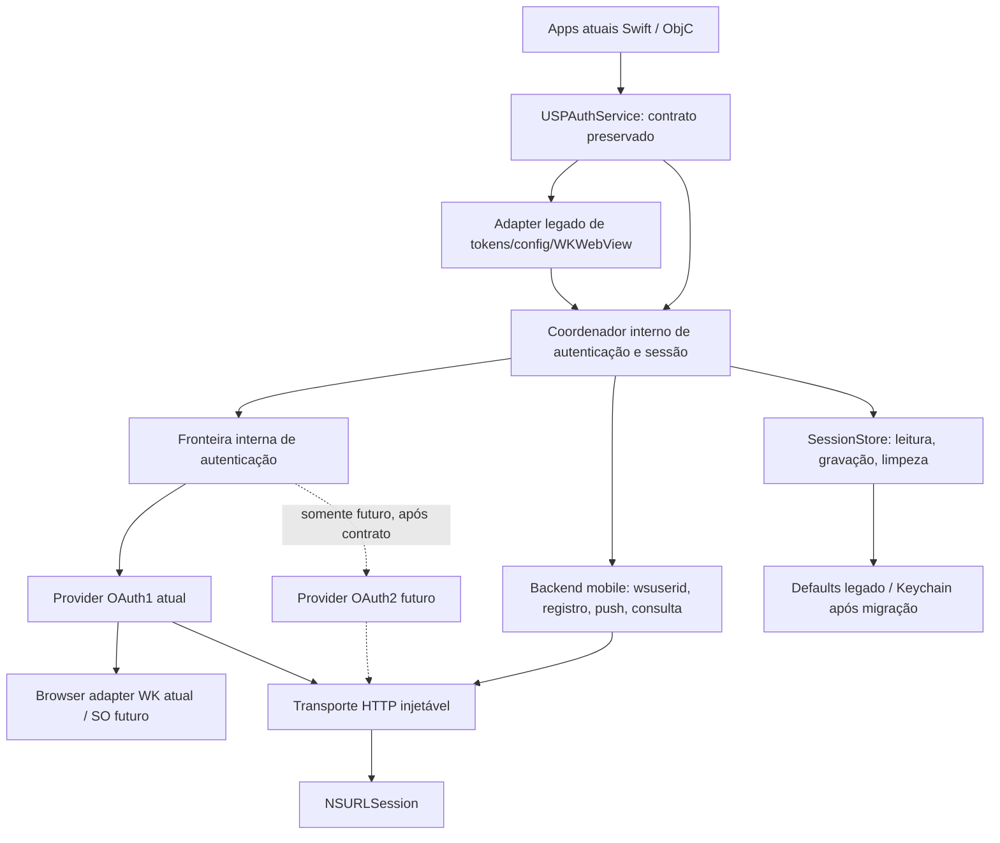
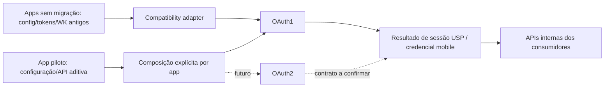

# Arquitetura alvo proposta

Proposta baseada na revisão `11d9582`; **não implementada**. [Roadmap](modernization-roadmap.md) · [Estado atual](current-architecture.md).

## Direção adequada ao código real

A fronteira de autenticação é útil: Service conhece o par OAuth, um controller concreto, assinatura do perfil e UI singleton. Entretanto USPAuthKit também é um cliente de perfil/registro/push do backend mobile. Um provider universal com authenticate/logout/restore/refresh obrigatórios confundiria essas responsabilidades e inventaria refresh inexistente.

Preferir uma fronteira **interna ObjC**, no target existente, após testes e transporte. Nenhum framework, registry de providers ou novo target é necessário. A API pública NSObject/callback continua; o singleton é composição default, não dependência imposta a toda instância. APIs Swift aditivas são opção posterior, sem obrigar async/await ou aumentar mínimo iOS.

## Responsabilidades e dados

| Fronteira | Responsabilidade | Dados permitidos cruzar / dados que ficam locais |
|---|---|---|
| App → USPAuthService | Configurar, apresentar login, obter usuário/credencial mobile, push, logout/consulta | API antiga permanece; API aditiva futura usa apresentação, sessão/erro, sem oauth_verifier/secret |
| Service → coordenador | Compatibilidade, cache policy e completion thread; montar dependências por instância | Operação/contexto de apresentação, estado de sessão, erro; credenciais legadas só via adapter |
| Coordenador → provider | Autorizar identidade e obter resultado autenticado; reconhecer credencial armazenada do próprio mecanismo | Resultado interno com perfil/credencial mobile ou handle opaco + erro; token/secret fica no provider1 |
| Provider1 → request builder/signer | Handshake, headers assinados, endpoints de identidade e normalização | Request assinada; consumerSecret/nonce/verifier não são modelo de sessão público |
| Provider → browser adapter | Iniciar interação, receber retorno/cancelamento, limpar delegates | URL de autorização/retorno só nesta fronteira privada, sem logging; presenter/presentation anchor é mecanismo de SO |
| Cliente mobile → transporte | registrar/invalidar/consultar e payload de push/app | wsuserid opaco, appKey, push; transporte não interpreta sessão nem escolhe protocolo |
| Transporte → URLSession | Executar request, devolver data/HTTPResponse/error e cancelamento | Não criar assinatura, não parsear usuário, não acessar defaults; política de redirects por operação |
| Coordenador/provider → store | Restaurar/gravar/limpar estado com schema e scope | Envelope versionado, identidade do mecanismo e escopo ambiente/app; credenciais em storage privado protegido |
| Observer opcional | Eventos e duração sem conhecer requests/segredos | Nome da etapa, resultado, categoria de erro, tempo, status permitido; sem body/URL/query/header/PII |

O perfil atual é obtido por request assinada: uma operação privada do provider1 pode entregar resultado com perfil, evitando que o service conheça signer. Não mover interpretação dos modelos USP para o signer. Caso o contrato futuro forneça perfil por endpoint separado, um cliente de identidade com autorização opaca pode ser extraído **nesse momento**, sem publicar generic request signing agora.

## Operações mínimas a confirmar nos testes

Nomes são ilustrativos, não interfaces já decididas:

| Operação | Dono proposto / contrato observável |
|---|---|
| Iniciar autenticação interativa | Provider com browser/contexto; um resultado terminal (sucesso/erro/cancelado), handle interno de cancelamento |
| Carregar sessão local | Store + coordenador; distinguir ausente, incompleta/corrompida, disponível; sem rede automática nem validade remota presumida |
| Interpretar/restaurar credencial | Provider reconhece envelope próprio; não exige campos OAuth no coordenador |
| Limpar sessão / cancelar tentativa | Coordenador cancela e impede writes tardios; provider limpa estado efêmero; store remove persistência |
| Registrar/consultar/invalidar credencial mobile | Cliente de backend separado, mantém API/callback/payload atuais; consulta não equivale a refresh |
| Renovar sessão | **Não adicionar agora**: não existe renovação atual. Capacidade só definida quando backend especificar renovação/reautenticação |
| Revogação remota / logout SSO | **Não tornar obrigatória**: logout público continua local no baseline; operações futuras aditivas e suporte explícito do provider/servidor |

Manter uma extensão privada para o caminho legado `loginInWebView` que só adquire tokens. A operação neutra de sessão completa pode reaproveitar essa etapa, buscar perfil e registrar no cliente mobile. Unificar sucesso dessas duas APIs silenciosamente seria regressão.

## Sessão sem impor OAuth2

Estado interno mínimo: perfil USP disponível, credencial de backend mobile opaca quando disponível, identificação/scope do provider, envelope privado de credencial, estado local da sessão e da operação. Não serializar tokenSecret como propriedade neutra. Uma sessão OAuth1 sem informação de prazo tem validade **desconhecida**, não infinita nem automaticamente expirada. `isLoggedIn` antigo mantém significado compatível até haver política aditiva documentada.

Expiração, scopes, refresh e state não entram como requisitos obrigatórios agora. Somente adicionar metadados/operações quando houver contrato real. Distinguir erro de transporte, HTTP, payload, configuração, cancelamento, operação em andamento e sessão rejeitada internamente; mapear a NSError legado com domain/code conhecidos no adapter, sem body/secret em userInfo. Futura API de erro público requer casos/tipos estáveis e testes ObjC/Swift.

## Composição e seleção

Começar com initializer **interno** que recebe transporte, store, clock/nonce e operação de browser. `init`, `initWithUserDefaults` e sharedService compõem provider1 default. HTTPClient já tem initWithSession: reutilizar o padrão e adicionar execução de request arbitrária quando os testes demonstrarem demanda. Protocol privado pequeno em ObjC torna substituição por doubles possível sem exportar arquitetura.

Futuramente uma factory interna escolhe provider a partir de configuração explícita aditiva. Não usar remote flag para reinterpretar configuração antiga consumerSecret como OAuth2: configuração antiga sempre seleciona provider1. DI de provider completo serve aos testes internos; não obrigar apps a implementarem provider e nem criar plugin registry. Troca de configuração deve cancelar tentativas e isolar/restaurar sessão pelo scope; comportamento precisa de testes e política de migração.

## Configuração

| Categoria | Hoje | Separação proposta |
|---|---|---|
| Biblioteca | singleton, comportamento main/completion, default HTTP | composição interna e política de operação |
| Ambiente | USPAuthEnvironment/baseURL, mesma base identidade/mobile | config de ambiente validada; hosts de identidade/mobile separados internamente se necessário |
| Provider1 | consumerKey/consumerSecret/endpoints/callback localhost | objeto privado OAuth1 derivado de USPAuthConfig, preservando endpoints |
| Segredos | consumerSecret no app/config, tokens/secret em defaults, wsuserid no JSON | credencial protegida/privada; segredo embarcado não ganha confidencialidade por wrapper |
| Dados do app | appKey/header backend, presenter, notificationToken/platform | configuração/entrada de cliente mobile e apresentação; classificação do header/appKey confirmada com backend |
| Provider futuro | não existe | config própria aditiva definida pelo servidor, sem reutilizar campos incompatíveis |

`config` e `appKey` são mutáveis e effectiveAppKey prioriza config. Preservar essa precedência no adapter, documentar conflitos e evitar introduzir segunda fonte de verdade sem testes. `Custom` no configure rápido não funciona: alternativa já é configureWithConfig/custom factory.

## Coexistência e compatibilidade

Coexistência inicialmente entre versões/apps, não dois logins simultâneos no mesmo singleton. Se backend exigir convivência por app, definir scope/provider persistidos e seleção antes da implementação. Não converter credenciais nem tentar OAuth1 automaticamente após falha OAuth2: rollback é configuração/release e reautenticação explícita, evitando downgrade silencioso e cruzamento de contas.

Adapter preserva getters/setters dos tokens1 e defaults legado enquanto necessário. Uma nova API/provider2 não pode prometer semântica para tokenSecret ou WKWebView antigo; consumidores dessas APIs permanecem em provider1 até migrar. Retirada apenas em major futura com evidência de adoção. Separar schema antigo/novo e tratar atualização/downgrade, falha de Keychain, item bloqueado, logout e troca de ambiente; não fazer dual-write duradouro de secrets em defaults após migração.

## Preparação OAuth2: perguntas ao backend, nenhuma implementação

| Tema futuro | Pergunta/gate e implicação arquitetural |
|---|---|
| Authorization Code | Qual grant suportado para apps nativos, endpoints e representação de erro? Não reutilizar request_token handshake |
| PKCE | Métodos/challenge e política servidor? Verifier transitório privado, não config pública; [RFC 8252](https://www.rfc-editor.org/info/rfc8252/) orienta apps nativos |
| state/redirect URI | URI registrada, correlação de tentativa e prevenção de mix-up? Browser boundary não deve fixar localhost ou WK |
| Access token | Audience/tipo e como acessar APIs USP? Não presumir igualdade com wsuserid |
| Refresh/expiration | Existe refresh, rotação, revogação/TTL? Store precisa suportar envelope versionado; clock e single-flight são internos |
| Scopes | Obrigatórios, opcionais, consentimento e mudanças? Não transformar vínculos institucionais em scopes |
| ASWebAuthenticationSession | Suporte de callback/apresentação, SSO e política efêmera? Adaptar SO dentro do SDK, preservar API legacy WK1 |
| Perfil/credencial mobile | Como são emitidos perfil e wsuserid ou substituto compatível? **Gate bloqueante** para minimizar impacto dos apps |
| Logout/revogação | Remover local, invalidar mobile, revogar autorização e encerrar SSO são suportados separadamente? Definir semântica antes de prometer logout remoto |
| Discovery/config | Endpoints estáticos ou discovery? Allowlist/issuer e validação; não adicionar discovery por antecipação |
| Rollout | Mesmo backend aceita providers simultâneos? Quotas/erros/rollback/downgrade e piloto definido |

Considerar também [RFC 9700](https://www.rfc-editor.org/info/rfc9700/) ao definir segurança futura. Não decidir campos, grants, endpoints ou refresh a partir desta tabela.

## Observabilidade opcional

Pontos: início/resultado/cancelamento da tentativa, etapa de perfil/registro, duração, falha de transporte, logout local/remoto distinguido e refresh somente se existir futuramente. Hook privado opcional com default no-op, futuro adapter do app se necessário; não depender de USPObservabilityKit, Firebase ou OTel. Esse product instrumenta requests dos apps e não é um motor de eventos de autenticação.

Payload restrito a etapas enumeradas, resultado/categoria/status e tempo; sem URL completa, headers, body, token, secret, verifier, code, número USP, nome, e-mail ou push. Não passar NSError bruto ao observer; operação ID efêmero sem identidade, política explícita de retenção do consumidor. Observabilidade é P2, posterior à fronteira e nunca requisito do login.
